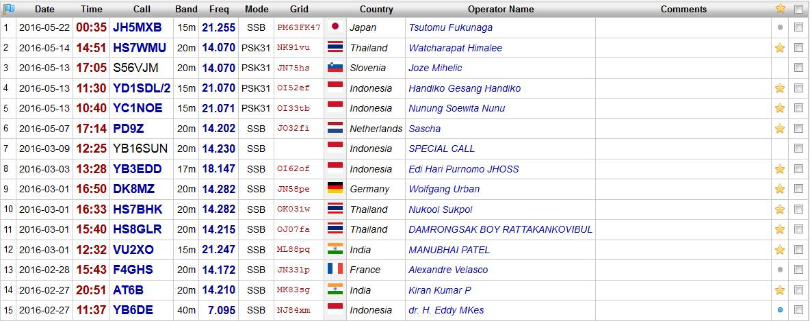

# 0. License

> Refer to [Amateur Handbook](http://www.imda.gov.sg/~/media/imda/files/regulation%20licensing%20and%20consultations/licensing/licenses/amateurhandbook.pdf) from [IMDA](https://www.imda.gov.sg/)

## Definitions

- **ITC** is International Telecommunication Convention
- **ITU** is International Telecommunication Union
- **ERP** is Effective radiated power
- **PEP** is Peak Emission Power
- **Teleprinter / teletypewriter / Teletype / TTY** is an electromechanical typewriter that can be used to send and receive typed messages from point to point and point to multipoint over various types of communications channels
- **Telephony** is the field of technology involving the development, application, and deployment of telecommunication services for the purpose of electronic transmission of voice, fax, or data, between distant parties.
- **RTTY** is Radio Teleprinter
- **CHU** is the call sign of a shortwave time signal radio station operated by the Institute for National Measurement Standards of the National Research Council of Canada
- **WWVB** is a time signal radio station near Fort Collins, Colorado and is operated by the National Institute of Standards and Technology (NIST)

## Exam format

- Section I Licensing Conditions
	- 35 multiple-choice questions *(1 hour)*
	- Syllabus:
		- Licensing Conditions
		- Operating Practices and Procedures
		- Transmitter Interference
- Section II
	- 60 multiple-choice questions *(1 hour 45 minutes)*
	- Syllabus:
		- Electrical Theory
		- Semiconductors
		- Radio Receivers and Transmitters
		- Propagation and Aerials
		- Measurement

---

### Qualification required of the holder of Amateur Station License

- **Amateur Station Licence** for operating radio transmission/reception equipment.
- pass **Radio Amateur's Examination** or qualification that is acceptable to IMDA
- IMDA may refuse without any reason
- Apply online via **Telcom Licensing System**
- Documents required: citizenship, results of the exam / valid cert, station license
- do not purchase equipment until it is approved

### License fee

- license is **renewable every 5 years**
- license fee currently is $100
- license fee must be **paid within 7 days of expiry** of the license
  - Late fees will be applicable afterwards.
- IMDA has waived the frequency application, processing fee and annual frequency usage fee

##### Important note:
- Admittedly, as of now, the exam is very old.
- Also, the current 2016 IMDA Handbook still reflects that the license is renewable **annually** and fee is **$50**
- Please check the IDA Handbook for any updates pertaining to changes in syllabus or regulations.
  - Advised to follow latest IMDA Handbook in regards to this.

### Amateur Station License

- be over `21`
- above `16`, the parents / guardian must sign off and be responsible for observation
-  radio amateur equipment is a model that is approved by IMDA

### Operation of an Amateur Ratio Station

- Observer and comply with
	- relevant provisions of the Telecommunications (Radio-communication) Regulations
	- relevant provisions of the Radio Regulations of the ITC
- amateur station license shall be displayed, in close proximity of the equipment, at the station's licensed address
- transmitting frequency bands allowed of an amateur radio station shall be at the discretion of IMDA
- frequency within the limits prescribed by the Radio Regulations, annexed to ITC of the ITU

### Transmitting power

- power of the transmitter shall **not exceed** `300 watts (DC input)`
- does **not cause radio frequency interference** to other licensed or authorised stations or networks or telecommunication installation or equipment
- maximum RF output power allowed for the Restricted Class Station License is `10 watts (erp)`

### Operational conditions for the Station

- operated at locations approved by IMDA
- operated in the presence of the licensee
- licensee will be responsible for the proper operations of the station
- tuning of the transmitter must ensure a **high degree of accuracy**
- all emissions must be **within the authorised bands**
- **no appreciable energy is radiated outside** the frequency limits
- a satisfactory method of **frequency stabilisation**
- Equipment must be capable of verifying that the emissions are within the authorised bands
- station shall always be equipped with **receiving as well as transmitting** equipment
- all equipment must be **erected, fixed, placed and used**
- equipment should not interfere with the efficient and convenient working of other authorised stations
- must seek **approval of any change** of equipment, antenna installation, location and address
- the licensee must **identify the transmission of a call sign** assigned to him by IMDA at the **beginning and end** of each period of transmission

### Transmission, Procedure & Limitation

- station may be operated at any time
- maximum of `10 minutes` of continuous transmission
- messages are
	- allowed
		- sent in plain language
		- relate solely to the licensee's experiments / personal affairs
	- not allowed
		- cannot relate to business affairs or transactions
		- cannot be grossly offensive / indecent / obscene character
- station cannot send:
	- Government prohibited communication of this nature
	- news
	- advertisement
	- communications of a business or non-experimental character
	- messages for pecuniary / monetary reward
	- messages for or on behalf of a third party
- Before making any call or test transmission, the frequency on which it is proposed to transmit should be monitored to ensure the transmission will not cause interference to other stations
- Calling other station
	- call-sign of that stations shall be sent `3 ≤ times ≤ 8`
	- signal **de** for **from** shall be sent `once`
	- call-sign of the calling station `3 times`
	- call sent `3 times` at interval of `2 minutes`
	- calling shall cease and may not be resumed until after an interval `15 minutes`
- conversant with the accepted international Q codes
- call sign must be sent for identification purpose at the beginning and end of each period of transmission
- prefix for Singapore licensed stations is `9V`

### Telelphony

- use international accepted **Phonetic Alphabet / figure guide**
- words used in this manner will have a **lesser chance of improper interpretation**

##### Phonetic Alphabet

| Letter to transmit | Word to be used |
| ------ | ------ |
| A | Alfa
| B | Bravo
| C | Charlie
| D | Delta
| E | Echo
| F | Foxtrot
| G | Golf
| H | Hotel
| I | India
| J | Juliet
| K | Kilo
| L | Lima
| M | Mike
| N | November
| O | Oscar
| P | Papa
| Q | Quebec
| R | Romeo
| S | Sierra
| T | Tango
| U | Uniform
| V | Victor
| W | Whisky
| X | X-ray
| Y | Yankee
| Z | Zulu

### Station log book

> Image credit: 9V1AN's public [log](https://qrz.com/db/9V1AN)

*"Grid" column (optional): [Maidenhead system](https://en.wikipedia.org/wiki/Maidenhead_Locator_System) for location*

- **indelible** (of ink or a pen making marks that cannot be removed) record shall be kept in a log-book
- **serially numbered**
- **date and time of commencement and ending** of every call made from the station
- call-signs of the stations from which messages addressed to
- **time (local or GMT)** of the commencement and termination
- **test transmissions** of the station
- frequency band(s) and class or classes of emission in each case
	- frequency in `MHz`
	- mode `SSB, PSK`, etc
	- band in `m`
- no gaps shall be left between entries
- all entries shall be made at the time of sending and receiving
- the record shall be **signed** at the time of recording by the licensee
- log book shall be kept for **at least 2 years**
- be available for examination at all reasonable times by an authorised officer of IMDA

### Interference

- **Equipment** must be designed, constructed, maintained and used in the operation of the station to avoid interference
- Operator **must not** cause any harmful interference to other authorised radio services or stations
- In the case of interference, the licensee shall take all possible steps to eliminate the source of such interference
- Precautions:
	1. avoid over-modulation
	1. keep the radiated energy within the narrowest possible frequency bands
	1. radiation of harmonics and spurious emissions shall be suppressed
- tests shall be made from time to time and details of those **tests shall be recorded** in the station log-book
- Adjustment of an amateur station shall, in general, be made by using a **dummy load**

### Portable / Mobile station

- only operate in the frequency bands
- only be allowed to operate in Singapore
- mobile / portable station and the general station **cannot be operated simultaneously**
- the call-sign = general station followed by `/M` or `/P`
- transmitter output power of the portable station shall not exceed `10 watts (erp)`
- licence may be modified or revoked at any time by IMDA without assigning any reason therefor
- it is readily movable from place to place to be operated therefrom
- station fee of $50.00 per mobile/portable station is **waived**
- station shall be closed down at any time on the demand of an authorised officer acting under the authority of IMDA

### Frequency checking equipment in amateur stations

- A licensee must:
	- be able to verify that his transmissions are within the authorised frequency band
	- no appreciable energy is radiated outside the band
	- use a satisfactory method of frequency control
	- transmissions do not contain unwanted frequencies
	- transmission do not contain harmonics and spurious frequencies
- station requires a **crystal reference source**
	- with a transmitter (crystal-controlled)
		- an absorption device of *suitable frequency range and accuracy* is necessary
		- check that the desired harmonic of the crystal frequency is selected
	- with a transmitter (not crystal-controlled)
	 	- a wavemeter based on a crystal oscillator is necessary
- Frequency measuring equipment
	- should be of sufficient accuracy
		- an accuracy of `±1.0%`: operation in the centre of the `21.0 MHz - 21.45 MHz` band
		- an accuracy of `±0.05%`: `10 kHz` of band-edge
	- verify that emissions are within the authorised frequency bands
- Heterodyne wavemeters and crystal calibrators
	- frequencies up to `4 MHz`: `100 kHz` crystal is usually adequate
	- higher frequencies: `500 kHz` crystal or preferably `1 MHz`
- Absorption wavemeters and similar devices
	- scale length and accuracy should be suitable for measurements of the required accuracy to be made
	- the **frequency coverage** must extend up to the **second and preferably the third harmonic** of the radiated frequency
	- For VHF and UHF transmitters
		- best technique is to measure the frequency of the fundamental oscillator as accurately as possible
		- use an absorption device to confirm that the wanted harmonic has been selected
	- VHF or UHF converter
		- the calibration of the main receiver can be checked with sufficient accuracy
		- also advisable to use an absorption wavemeter to check the measurement and to confirm that no unwanted radiations are present

### Frequency bands, power and classes of emissions

| Conditions | Frequency Bands   (in MHz) | Classes of Emission | Maximum DC Input Power | RF Output PEP   for A1, A2 and A3
| ------ | ------ | ------ | ------ | ------ |
| - shared by other services   - RTTY may not be used | `1.8 - 2.0` | A1A, A1B,   A2A, A2B    F1A, F1B, F2A, F2B    A3E, R3E, G3E, H3E, J3E, F3E | 10 watts | 26.67 watts
| - shared by other services | `3.5 - 3.9` | same as above | 300 watts | 800 watts
| band `10.1 - 10.15`   is allocated on secondary basis | `7 - 7.10`,   `10.1 - 10.15`,   `14 - 14.35`,   `18.068 - 18.168`,   `21 - 21.45`,   `24.890 - 24.990`,   `28 - 29.7` | same as above | 300 watts | 800 watts
| - need consent from IDA   - CW operators use the lower band   - other classes of emission use the mid and upper band | `144 – 146` | same as above | - | 25 watts |
| - need consent from IDA (include power, conditions, operations)   - shared by other services   - only certain spot Frequencies are allocated in Amateur Service -  |  `430 – 440` | same as above | - | Table below
| same as above |  `1240 - 1300`,   `2300 - 2450`,   `3300 - 3500`,   `5650 - 5850`,   `10000 - 10500` | same as above | | Subject to licensing conditions
| same as above | `24,000 - 24,050`   `24,050 - 24,250` | same as above |  | Subject to licensing conditions
| same as above | `2,350 - 2,400`, `5,700 - 5,800` | K1A, K2A, L2A, K2E and L3E | - | As above

##### Band plan and spot frequency

| # | Band (MHz) | Mode | Frequencies (MHz) | Maximum Output Power |
| --- | --- | --- | --- | ---
| 1 | 432.000 - 432.150 | Continuous Wave (CW) only | 432.000 | 10 watts erp
| 2 | 432.150 - 432.500 | Single-Sideband (SSB) and CW only | 432.200 | 10 watts erp
| 3 | 432.500 - 432.800 | Radio Teleprinter (RTTY) Facsimile (FAX) | 432.600 | 10 watts erp
| 4 | 433.375 - 434.600 | FM Simplex Channels | 433.625, 433.650 | 10 watts erp

### Modulation symbols

The ITU uses an internationally agreed system for classifying radio frequency signals. Each type of radio emission is classified according to its **bandwidth, method of modulation, nature of the modulating signal, and type of information transmitted** on the carrier signal. It is based on characteristics of the signal, not on the transmitter used.

[Modulation types](https://en.wikipedia.org/wiki/Types_of_radio_emissions#Type_of_modulation) (1st digit)

| Symbol | Modulation | Carrier | Sideband | Example
| --- | --- | --- | --- | ---
| A | amplitude | | Double | AM broadcast radio
| R | |	reduced or variable | Single
| G |	phase
| H | |	full | Single | as used by CHU
| F |	frequency | | | FM broadcast radio
| J |	| suppressed | Single | Shortwave utility and amateur stations
| K |	pulse amplitude  
| L |	pulse width | | | used by WWVB

[Type of modulating signal](https://en.wikipedia.org/wiki/Types_of_radio_emissions#Type_of_modulating_signal) (2nd digit)

| Number | Channel | Info | Subcarrier | Others
| --- | --- | --- | --- | ---
| 0 |	No modulating signal
| 1 |	One | digital | none |  without modulating audio frequency
| 2 |	One | digital | using | with modulating audio frequency
| 3 |	One | analog

[Type of transmitted information](https://en.wikipedia.org/wiki/Types_of_radio_emissions#Type_of_transmitted_information) (3rd digit)

| Symbol | Type | Decoded by | Example
| --- | --- | --- | ---
| N | | |	No transmitted information
| A |	Aural Telegraphy | by ear | Morse code
| B | Electronic Telegraphy (Teletype) |  | radioteletype and digital modes
| E |	Telephony | by human | voice or music

More Examples:

| No. | Type | Symbol | Description
| --- | --- | --- | ---
| 1 | Amplitude Modulation | A1A | Morse telegraphy
| 2 | Amplitude Modulation | A1B | Teletype telegraphy
| 3 | Amplitude Modulation | A2A | Morse telegraphy
| 4 | Amplitude Modulation | A2B | Teletype telegraphy
| 5 | Amplitude Modulation | A3E | Telephony, double-sideband
| 6 | Amplitude Modulation | R3E | Telephony, single-sideband, reduced carrier
| 7 | Amplitude Modulation | H3E | Telephony, single-sideband, full carrier
| 8 | Amplitude Modulation | J3E | Telephony, single-sideband, suppressed carrier
| |
| 1 | Frequency Modulation | F1A | Morse telegraphy by frequency-shift keying
| 2 | Frequency Modulation | F1B | Teletype telegraphy by frequency-shift keying
| 3 | Frequency Modulation | F2A | Morse telegraphy by on-off keying of frequency-modulating audio frequency
| 4 | Frequency Modulation | F2B | Teletype telegraphy by on-off keying of frequency-modulating audio frequency
| 5 | Frequency Modulation | F3E | Telephony by frequency modulation
| 6 | Frequency Modulation | G3E | Telephony by phase modulation
| |
| 1 | Pulse Modulation | K1A | Telegraphy by on-off keying of a pulse carrier
| 2 | Pulse Modulation | K2A | - Telegraphy by on-off keying of a modulating audio frequency or frequencies or by on-off keying of a modulated pulse carrier   - the audio frequency or frequencies modulating the amplitude of the pulses.
| 3 | Pulse Modulation | L2A | - Telegraphy by on-off keying of a modulating audio frequency or frequencies or by on- off keying of a modulated pulsed carrier   - the audio frequency of frequencies modulating the width (or duration) of the pulses.
| 4 | Pulse Modulation | K2E | Telephony, amplitude modulated pulses
| 5 | Pulse Modulation | L3E | Telephony, width (or duration) modulated pulses

### International Q Codes

| | | Type | Question | Answer
| --- | --- | --- | --- | ---
| 1 |QRG | frequency | Will you tell me my **exact frequency**? | Your exact frequency is ____ kHz
| 2 |QRH | frequency | Does my **frequency vary**? | Your frequency varies
| 3 |QRI | frequency | What is the **tone of my transmission**? | The tone of your transmission is (a) good, (b) variable, (c\) bad
| x |QRJ | x | x
| 5 |QRK | interference | What is the **intelligibility** of my signals? | The intelligibility of your signals is (a) bad, (b) poor, (c\) fair, (d) good, (e) excellent
| 6 |QRL | interference | Are you **busy**? | I am busy. Please do not interfere.
| 7 |QRM | interference | Is my transmission being **interfered** with? | Your transmission is being interfered with (a) nil, (b) slightly, (c\) moderately, (d) severely, (e) extremely
| 8 |QRN | interference | Are you troubled by **static**? | I am troubled by static (a) nil, (b) slightly, (c) moderately, (d) severely, (e) extremely
| 9 | QRO | power | Shall I **increase transmitter power**? | Increase transmitter power
| 10 | QRP | power | Shall I **decrease transmitter power**? | Decrease transmitter power
| 11 | QRQ | speed | Shall I send **faster**? | Send faster ( ___ words per minute)
| 12 | QRS | speed | Shall I send **slowly**? | Send more slowly ( ___ words per minute)
| 13 | QRT | speed | Shall I **stop** sending? | Stop sending
| 14 | QRU | call | Are you **ready**? | I am ready
| 16 | QRX | call | When will you call me **again**? | I will call you again at ___ hours on ___ kHz
| 17 | QRZ | call | **Who** is calling me? | You are being called by ___ on ___ kHz
| |
| 18 | QSA | signals | What is the **strength** of my signals? | The strength of your signals is (a) scarcely perceptible, (b) weak, (c\) fairly good, (d) good, (e) very good
| 19 | QSB | signals | Are my signals **fading**? | Your signals are fading
| 20 | QSD | signals | Are my signals mutilated? | Your signals are mutilated
| 21 | QSL | communicate | Can you acknowledge receipt? | I am acknowledging receipt
| 22 | QSO | communicate | Can you communicate with ___ direct? | I can communication with ___ direct
| 23 | QSP | communicate | Will you relay to ___ | I will relay to ___
| 24 | QSV | communicate | Shall I send a series of V's for adjustment on this frequency? | Send a series of V's.
| 25 | QSZ | communicate | Shall I send each word or group more than once? | Send each word or group twice
| |
| 26 | QTH | location | What is your location? | My location is ___
| 27 | QTR | time | What is the correct time? | The correct time is ___ hours.
