# 4. Alternating Current

## Definitions

- **Capacitance** is the stored charge between 2 metal plates
- **Dielectric** is the insulated barrier separating 2 plates in a capacitor
- **Fleming’s Left Hand Rule**: When a *current* is passed through a coil in a magnetic field, a force acts on the coil to try and make it turn
- **Fleming’s Right Hand Rule**: If a *conductor* is moved through a magnetic field an electric current will be generated
- **Amplitude** is the height of a waveform
- **Peak** value of a waveform is the maximum positive or negative value
- **Peak to peak** value is the difference between the maximum positive and maximum negative value. It is normally twice the peak value.
- **RMS (root mean square)** is the equivalent D.C. current or voltage that would produce the same heating effect as the A.C. waveform
- **Out of phase** waveforms have the same frequency but start at different times
- **In phase** waveforms have the same frequency and start at the same time
- **Capacitive reactance** is a measure of a capacitor's *opposition* to AC
- **Inductive reactance** is a measure of an inductor's *opposition* to AC
- **Resonant frequency** is the frequency at which the inductive reactance is equal and opposite to capacitive reactance in a series tuned circuit
- **Magnification / Q Factor** is the ratio of the voltage across the inductor (or capacitor) to the supply voltage at resonance
- **Bandwidth of a selectivity curve** is the frequency range where the output is at least 0.707 of the maximum value
- **Filter** is a circuit that will pass some frequencies and reject others

## Units of measurement

- `Farads` is a unit of capacitance
- `Joules` is the unit of work done
- `Degrees` is the unit for phase
- `Henrys` is the unit for inductance

## Formula

- `E = ½(CV²)` where `E` is energy stored in capacitor
- `Q = CV` where `Q` is quantity of electricity, `C` is capacitance, `V` is voltage
- `T = RC` where `T` is time constant, `C` is capacitance, `R` is resistance
- `C = C₁ + C₂ + C₃` where `C` is total capacitance in parallel
- `1/C = 1/C₁ + 1/C₂ + 1/C₃` where `C` is total capacitance in series
- `RMS √2 = RMS x 1.414 = V (peak)` where `RMS` is the RMS / DC equivalent voltage, `1.414` is root 2, `V (peak)` is the maximum peak voltage
- `ω = 2πf` where `ω` is angular rotation
- `Xc = 1/ωC = 1/(2πfC)` where `Xc` is capacitive reactive, `ω` is angular rotation
- `Xc = V / I` where `Xc` is the reactive capacitance, `V` is the DC Voltage, `I` is the AC
- `XL = ωL = 2πfL` where `XL` is inductive reactance
- `Z = √(R² + XL²)` where `Z` is impedance, `R` is resistance, `XL` is inductive reactance for an RL series circuit
- `Z = √(R² + Xc²)` where `Z` is impedance, `R` is resistance, `Xc` is capacitive reactance for an RC series circuit
- For an RLC series circuit:
  - `V² = (VL - Vc)² + Vr²` where `V` is total voltage, `VL` is voltage across inductor, `Vc` is voltage across capacitor, `Vr` is voltage across resistor
  - `V ∝ Z`
  - `Z² = (XL - Xc)² + R²` where `Z` is total impedance, `XL` is inductive reactance, `Xc` is capacitive reactance, `R` is resistance of the resistor
- 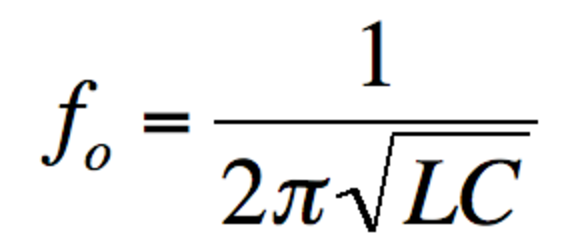

  or `2πf = 1/√(LC)` where `fo` is resonant frequency, `L` is inductance, `C` is capacitance
- `Z = L/CR` where `Z` is dynamic impedance in a parallel tuned circuit at resonance, `L` is inductance of the inductor, `C` is capacitance of the capacitor, `R` is resistance of the resistor
- `Q = fo / (f2 – f1)` where `Q` is the ratio, `fo` is resonant frequency, `f1` is lower bound, `f2` is upper bound

## Circuit diagrams

- Capacitor-resistor in series

  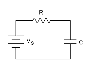
- Inductor-resistor in series

  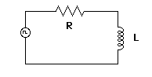
- RLC (resistor-inductor-capacitor) circuits:
  - series circuit

    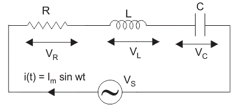
  - parallel circuit

    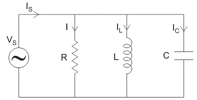
- Parallel tuned circuit

  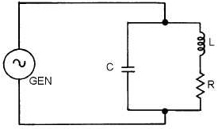

## Graphs

- Leading and lagging

  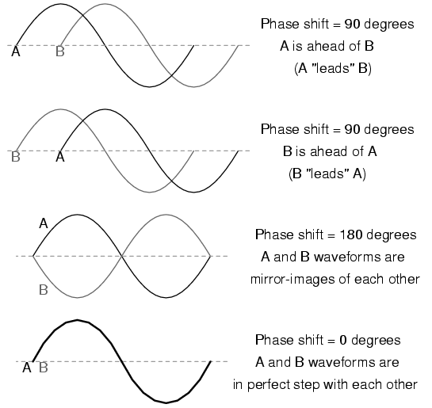
- Vector diagram
  - angular rotation always goes *anti-clockwise* starting from *3 o'clock*

  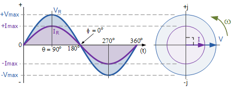
- Capacitor current-voltage phasor diagram

  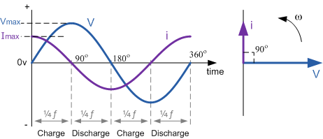
- Inductor current-voltage phasor diagram

  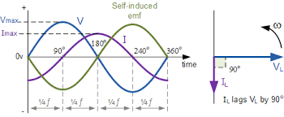
- Phasor diagram comparison

  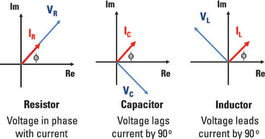
- Capacitive reactance

  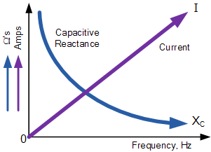
- Impedance
  - Capacitor-resistor in series circuit

    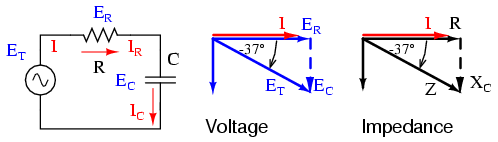
  - Inductor-resistor in series circuit

    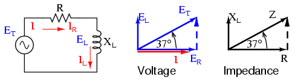
- Total voltage `Vs` in RLC series circuit

  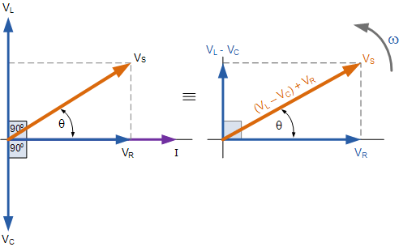
- Total impedance `Z` in RLC series circuit

  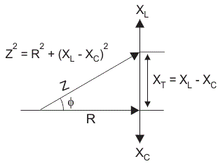
- Total current `Is` in RLC parallel circuit

  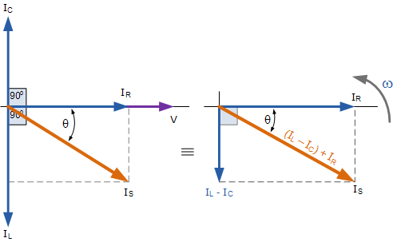
- Resonant frequency

  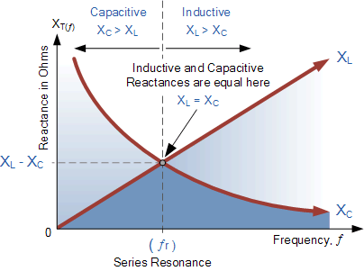
- Tuned circuit resonant frequency
  - series circuit

    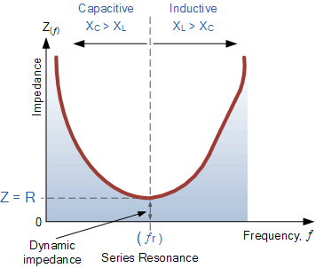
  - parallel circuit

    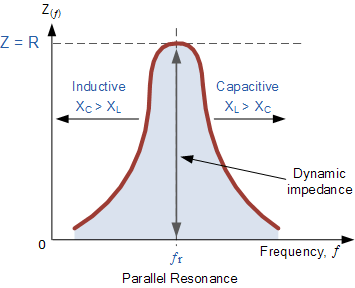
- Bandwidth in a parallel tuned circuit

  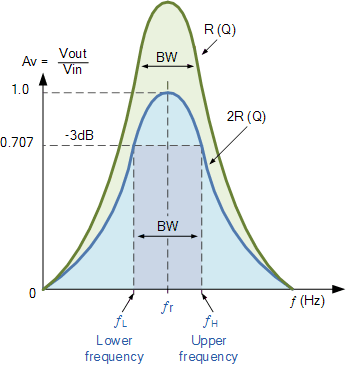
- response graphs

  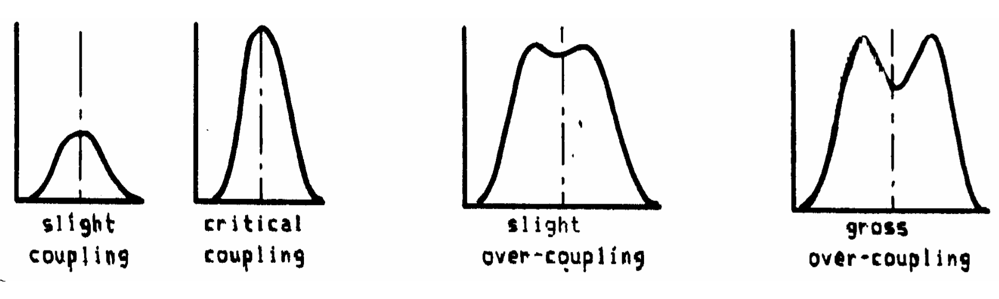

> Image credit: [Electronic tutorial](http://www.electronics-tutorials.ws/)

## Notes

### Capacitance

- 2 metals are connected by battery
- Plate "B" is now negatively charged and repels so strongly that the current ceases
- The plates have a  very  small capacitance for the storage of electricity
- very important to  have  insulation  (dielectric) between the plates that will stand up to the voltage that is to be used

Capacitance of a capacitor is:

- `∝` area of the plates
- `1/∝` distance between the 2 plates
- `∝` permittivity of the dielectric between the plates

| Material  | Permittivity |
| ----- | ----- |
| Air  | 1  |
| Dry paper | 2.5  |
| Glass | 5  |
| Mica | 7  |

### Construction of capacitors

1. Paper capacitors
  - "sandwich” of strips of foil and wax impregnated paper
  - 2 foil forms the plates
  - waxed paper is the dielectric
- Mica capacitor
  - alternate layers of  thin  metal sheet
  - thin layers of mica as dielectric
- Silvered mica
  - Silver is  sprayed  on the sheets of mica to form the plates
  - advantages:
    - possible to make these capacitors very accurately
    - value of the capacitance  changes very little  with  wide temperature changes
  - E.g. suitable for the tuned circuits in oscillators
- Ceramic capacitors
  - small  pieces  of  ceramic that have a coating  of silver on each side
  - E.g. suitable for de-coupling
  - disadvantages
    - large  capacitance  variations  with changes of temperature
    - should not be used for tuned circuits
- Electrolytic Capacitors
  - two  aluminum  foil  strips
  - interleaved with an absorbent paper strip and wound  very tightly into a cylinder
  - one  capacitor  plate is one of the foil strips and the other  plate  is the electrolyte
  - the oxide acting  as the insulating dielectric
  - !! very important to ensure that electrolytic capacitors are connected right way round in any circuit
- Variable capacitors (tuning capacitors)
  - one set of fixed plates and one set of moving plates
  - dielectric is usually air
  - When the plates are rotated they overlap, and hence the capacitance, changes

### Alternating Current

- Generator
  - has a coil that continues to rotate in the same direction
  - produces electricity that flows in one direction for half a revolution and reverses in the next half cycle
  - current and voltage are in sine-wave

### Capacitance

- When a voltage is applied to a capacitor the initial charge *current is high* at a time when the *voltage is small*
- In a capacitive circuit:
  - current *leads* the voltage by 90°
  - voltage *lags* the current by 90°

### Inductance

- In an inductor, voltage *leads* the current by 90°

### RLC Circuit

| | Series  | Parallel |
| ----- | ----- | ----- |
| Voltage across each component | calculate  | same |
| Current across each component | same  | calculate |
| R (resistor) | resistance in phase with voltage | resistance in phase with voltage |
| response curve resonant frequency | at minimum resistance  | at maximum resistance |
| resonant frequency circuit | acceptor circuit  | rejector circuit |

*Tuned circuits are used in oscillators and radio receivers. They can be used to select one frequency when many are present.*

#### Selectivity

- A high Q circuit has good selectivity of frequencies
- A low Q circuit has poor selectivity of frequencies
- Parallel tuned circuit would typically have a `Q` of `50`

### Filters

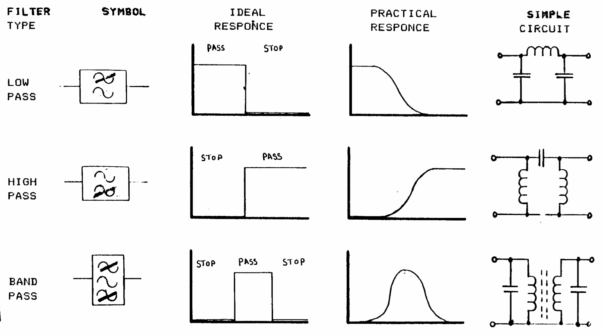
