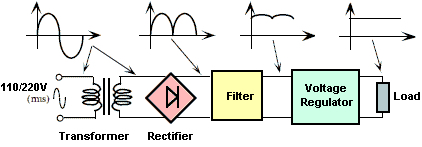
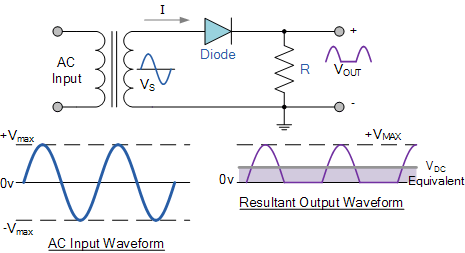
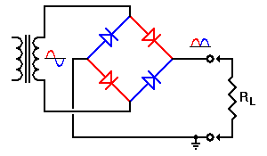
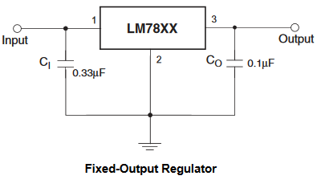
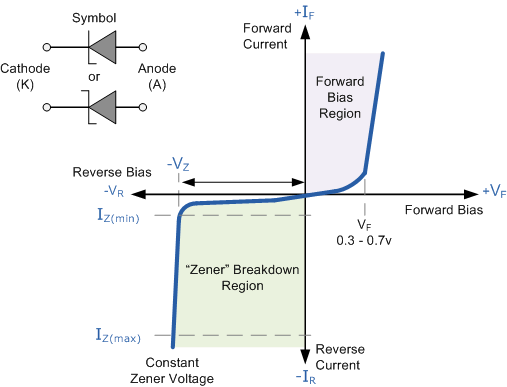

# 5. Power Supply Units

## Definitions

- **Half wave rectification** will allow current flow through the load during the positive half cycles
- **Full wave rectification** will allow current flow through the load during both positive and negative cycles
- **Diode bridge configuration** circuit allows for full wave rectification of an input AC souce
- **Voltage Regulators** are circuits that help to maintain a constant voltage output

## Diagrams

Power Supply Unit

> Image credit: [Electronics Area](http://electronicsarea.com/wp-content/uploads/regulated_power_source_block_diagram.gif)

## Circuit diagrams

- Half-wave rectification

  
  > Image credit: [Electronics Tutorial](http://www.electronics-tutorials.ws/diode/diode_5.html)
  
- Full-wave rectification

  
  > Image credit: [Electronics Tutorial](http://www.electronics-tutorials.ws/diode/diode_6.html)

  
  > Image credit: [Play hookey](http://www.play-hookey.com/ac_theory/power_supply/ps_rectifiers.html)
  
- Voltage regulators 
  

  > Image credit: Fairchild Semiconductor

## Graphs

- Zener diode graph

  
  > Image credit: [Electronics Tutorial](http://www.electronics-tutorials.ws/diode/diode_7.html)

## Notes

Most modern Amateur Radio equipment operates:

- `13.8 V DC` low voltage supply
- `20 A` high current

Power supply from:

- outdoors: car battery
- indoors: convert the 230 Volt AC "mains" to 12 Volt DC

| Power Supply Unit  | Components | Description |
| --- | --- | --- |
| Mains | 230V AC |
| Transformer | step-down Transformer | (1) capable of handling the required power   (2) primary winding of the transformer usually has a few "taps" so that various mains voltages can be used
| Rectifier | 1 or more diodes | (1) very simple circuit will produce a great deal of hum at the supply frequency `50 Hz`   (2) A full wave rectifier circuit gives an output that contains hum at twice the supply frequency `100 Hz` |
| Smoothing (filtering) | large capacitor | In order to further reduce the hum an inductor and a another large capacitor are added |
| Stabilizer (Voltage regulator) | zener diode | (1) If a zener diode is reversed biased there is a critical voltage at which the current flow increases dramatically   (2) Beyond this "knee" in the characteristic, a very small change in voltage will result in a large change in the current passed
| Output | load |
