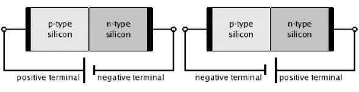
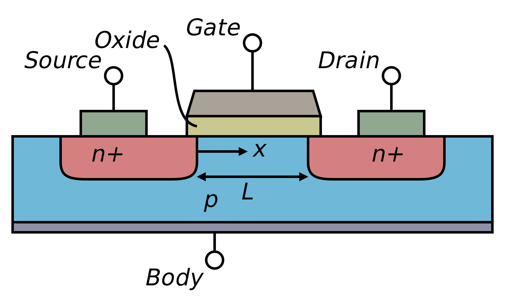
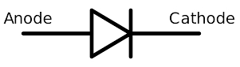
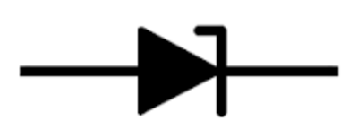
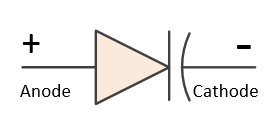
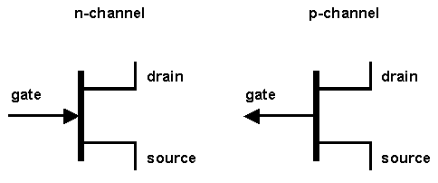
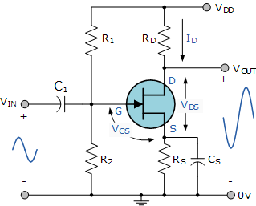
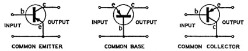
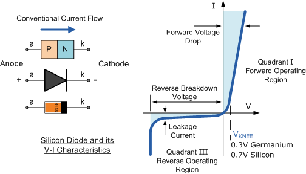
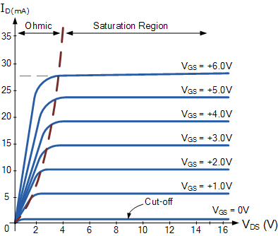

# 6. Semiconductors

## Definitions

- **Transistors** are low impedance, current operated devices
- **Thermal Runaway** is self destruction of the transistor when the the current passing through a transistor increases, heat is generated
-  **Depletion layer** is an area depleted of mobile electrons (or holes) for carrying current
- **Ohmic region** is the steep part of the curve and it is similar to resistance

## Diagrams

- Forward bias and reverse bias

  
  > Image credit: [Academics easy](http://www.academicseasy.com/2014/10/diodes.html)
- Field Effect Transistors (source +, drain -)

  
  > Image credit: [Wikipedia](https://en.wikipedia.org/wiki/Field-effect_transistor)

## Circuit Symbols

- Diode

  
- Zener Diode

  
- Variable capacitor diode

  
- Transistors with emitter, base and collector

  
- Field Effect Transistors

  

## Circuits

- FET Amplifier

  
  > Image credit: [Electronics Tutorials](http://www.electronics-tutorials.ws/amplifier/amp_3.html)
- Common Emitter, Common Base, Common Collector

  
  > Image credit: [Vintage radio](http://www.vintage-radio.com/repair-restore-information/transistor_biasing.html)

## Graphs

- Diode graph

  
  > Image credit: [Electronics Tutorials](http://www.electronics-tutorials.ws/diode/diode_4.html)
- FET Graphs

  
  > Image credit: [Electronics stackexchange](https://electronics.stackexchange.com/questions/227706/understanding-id-ugs-and-id-uds-graph-of-a-nmosfet)

## Notes

### P-type and N-type

- Germanium has four electrons in its outer orbit
- 4 valence electrons are used in current flow
- Pure Germanium does not conduct electricity
- if a minute quantity of a certain impurity is added, its resistance is greatly reduced

| | N-type  | P-type |
| --- | --- | --- |
| Impurity  | Arsenic | Indium
| Valency  | 5  | 3
| Name | N-type: mobility of electrons | P-type: mobility of a missing electron (hole)
| Condition | an excess of electrons | an excess of holes

### Forward and reverse biased

| Forward bias | Reverse bias |
| --- | --- |
| `(+)` terminal of battery is connected to `p-type`   `(-)` terminal of battery is connected to `n-type` | `(+)` terminal of battery is connected to `n-type`   `(-)` terminal of battery is connected to `p-type`
| depletion layer is very thin  | depletion layer is very thick
| p-n junction offers low resistance | p-n junction offers high resistance
| ideal diode have zero resistance | ideal diode has infinite resistance
| current will flow | no current will flow
| low impedance | high impedance

### Diode

- Current flows when the voltage is positive
- Virtually no current flows when the voltage is negative
- Forward part of the characteristic is not linear
- Small positive voltage is needed for current flow
  - `0.3V` for Germanium
  - `0.7V` for Silicon (more pd. is needed as there are lesser atom shells to remove the valence electron for current flow)
- Reverse (-V) direction just a few `µA` flows unless the breakdown voltage is exceeded

#### Zener diode

- Reverse characteristic can be designed to pass a considerable current
- Pre-designed critical voltage
- Application: voltage stabilizer circuits

#### Variable capacitance diode

- self capacitance of a diode varies as the voltage is changed
- reverse characteristic can be designed so that this change in capacitance can be used
- Application: electronic tuning circuits

### Bipolar Junction Transistor

- PNP (usually Germanium) and NPN (usually Silicon)
- 3 currents at Emitter, Base and Collector are interdependent
- Input and output current are almost the same
- Large difference between the input and output impedances that is the key to transistor amplification because `P = I²R`
- There is no direct connection between Emitter and Collector

### Transistor operation

| NPN / PNP | Common   base | Common   emitter | Common   collector*  |
| --- | --- | --- | --- |
| Current gain | < 1 | 49 | 50
| Power gain | 1000 | 1000 | < 1
| Input impedance| Low  | Med | Hi
| Output impedance | Hi | Med | Lo

\* *Common collector == emitter follower*

For practical transistor biasing, the *base* should be

- `0.3v` more negative than the *emitter*, for a PNP Germanium transistor
- `0.3v` more positive than the *emitter*, for NPN Germanium transistor
- `0.7v` more positive than the *emitter*, for NPN Silicon transistor
- `0.7v` more negative than the *emitter*, for PNP Silicon transistor

### Thermal runway

- Precaution:
  - a resistor in the emitter lead
    - will act in opposition to base bias and reduce current
  - by-pass (decoupling) capacitor is usually connected across the emitter resistor
    - to avoid a reduction of the A by-wanted AC signal

### Field Effect Transistor

- Connections are made to each end of the N type channel material
- Small negative Gate voltage:
  - creates a small depletion area
  - current carrying channel is slightly restricted
- medium negative Gate voltage:
  - creates a medium depletion area
  - current carrying channel is further reduced
- higher negative Gate voltage
  - makes the depletion areas meet in the middle
  - completely blocks the channel, cutting off the current flowing from Drain to Source

#### FET Amplifier

- Source resistor is by-passed with a large capacitor to prevent a reduction in the wanted AC Signal
- The input impedance will be very high; the same  value of the gate resistor
- The output impedance will equal the Drain load resistor
- !! Take care to not build up static electricity: don't wear nylon t-shirt while soldering
- Precaution: It has high impedance

### Integrated circuits

- E.g. Transistors, amplifiers, mixers, radio receivers
- Made of Silicon and are connected to the PCB via legs / pins
- Not applicable: Speaker, variable capacitor, coils
