# 7. Amplifiers and Receivers

## Definitions

- **Coupling capacitor** is a capacitor which is used to couple or link together only the AC signal from one circuit element to another. The capacitor blocks the DC signal from entering the second element and, thus, only passes the AC signal.
- If a proportion of the output of an amplifier is fed back, in phase, to the input it is known as **positive feedback**
- **Amplifier Classes** represent the amount of the output signal which varies within the amplifier circuit over one cycle of operation when excited by a sinusoidal input signal.
- **Crossover distortion** happens in push-pull amplifier circuits when a signal "crosses-over" from positive to negative or vice versa.
  - Caused by a small delay between transistors turning on and off during a transition from positive to negative or otherwise.
  - Can be fixed by pre-biasing the transistors using diodes or a voltage divider.
- The **class A amplifier** has the highest linearity over the other amplifier classes and as such operates in the linear portion of the characteristics curve.
- **Push-pull amplifier** means one transistor amplifies the positive half cycles and the other transistor amplifies the negative half cycles
- A ganged capacitor are two or more tuning capacitors that are adjusted at the same time by the same shaft.

## Images 

- Picture of ganged capacitor

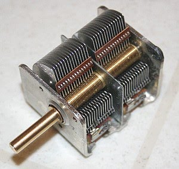

## Circuit symbols

- Symbol for ganged capacitor

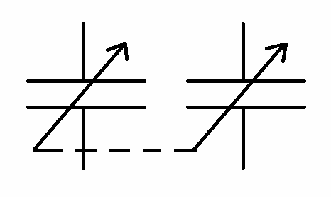

## Graphs

- Waveform seen during crossover distortion

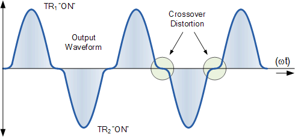

## Circuit diagrams

- 2-stage amplifier

  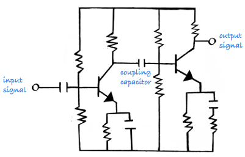
- Double tuned amplifier

  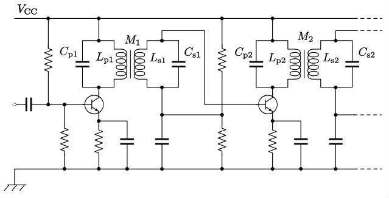
  > Image credit: [Wikipedia](https://en.wikipedia.org/wiki/Double-tuned_amplifier)
- Audio oscillator

  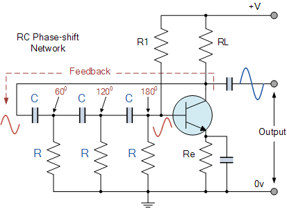
- Amplifier Class A

  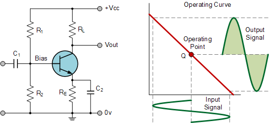
- Amplifier Class B

  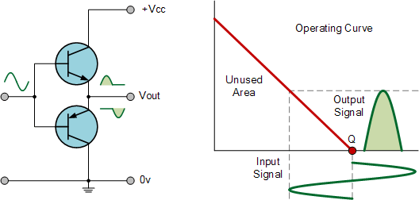
- Amplifier Class C

  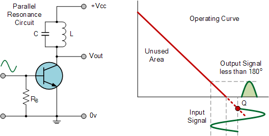
- High pass filter

  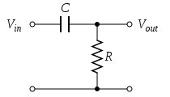
- Low pass filter

  
- Superhetrodyne receiver

  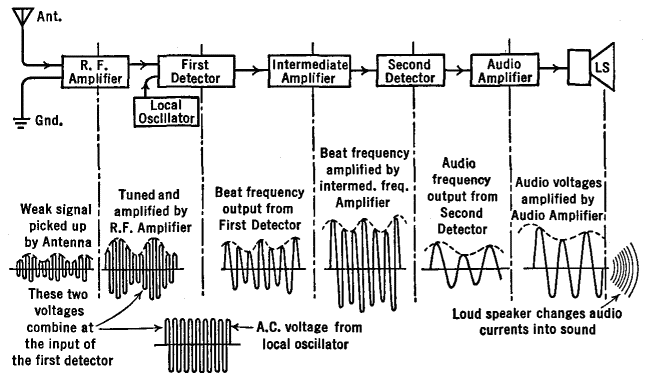
  > Image credit: [Vias](http://www.vias.org/basicradio/basic_radio_33_06.html)

## Graphs

- amplifier efficiency

  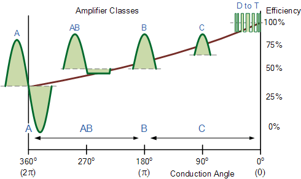

## Notes

### Amplifiers

##### 2 stage amplifiers

- If there was no *coupling capacitor*, second
transistor would be destroyed due to incorrect biasing
- coupling capacitor passed the AC signal but blocks the DC voltage

##### Double tuned amplifiers

- At the collector:
  - resistor is replaced by a *double tuned transformer*
- At the base:
  - the base bias is still determined by the base bias resistors that are then connected to the base via the *secondary winding of the transformers*
- The output impedance of the transistor, being very low, has to be matched to the tuned circuit by using a 'tap' on the primary winding
- This is the circuit of an I.F. (Intermediate Frequency) Amplifier

### Oscillators

##### Tuned collector oscillator

- Uses positive feedback
- Stable oscillation will occur if there is just enough positive feedback

##### Audio oscillator

- Each resistor/capacitor combination is designed to give a `60°` phase change
- 3 such RC combinations are used to give the required `180°`

### Amplifier classes

| Amplifier Class | Conduction angle | Conduction Angle | Operating efficiency |
| --- | --- | --- | ---
| Class-A | Full cycle `360°` | `θ = 2π` | `50%`
| Class-B | Half cycle `180°` | `θ = π` | `66.6%`
| Class-AB | Slightly more than `180°` | `π < θ < 2π`
| Class-C | Slightly less than `180°` | `θ < π` | `80%`
| Class-D to T | ON-OFF non-linear switching | `θ = 0`

##### Class A amplifiers

- base bias is set so that the whole of the input signal uses a central portion of the curve
- **Distortion** has taken place if the output signal is not the same shape as the input signal
- The main causes of distortion are:
  - Incorrect bias point
    - too low --> flattened bottom
    - too high --> flattened top
  - Input signal too great
    - flat bottom and top

*Application: Hi-Fi audio, SSB/AM transmission or anything that requires high linearity*

##### Class B amplifiers

- collector current only flows for 50% of input cycle
- An advantage of Class 'B' operation is that it can deliver more power than Class 'A' but it requires two transistors in a push-pull configuration.
- More power efficient
- **Crossover distortion** may occur, which may affect linearity

*Application: drive a loud speaker*

##### Class C amplifiers

- Operation of transistor is biased well beyond the *cut-off*
- It is only necessary to give a regular push to
keep it going (E.g. like a swing)
- Such amplifiers use tuned resonant circuits as their collector load and they only need pulses of signal
- **Not for use** when application demands linear operation.

*Application: Used in amplification of FM signals*

### Superhetrodyne Receiver

- Crystal set
  - The wanted frequency is "tuned in" by the variable capacitor in the parallel tuned aerial circuit
  - Diode detects this minute signal
  - *Disadvantage*: Signal is too soft and needs a headphone to hear
- Add an Audio amplifier
  - Signal is amplified so that it is sufficient to operate a loud speaker
  - *Disadvantage*: does not improve the sensitivity of the crystal set
- Add a Radio Frequency Amplifier
  - Both the aerial circuit and Radio Frequency Amplifier are tuned to the wanted frequency
  - *Disadvantage*: does not make the receiver very sensitive
- Add more RF Amplifiers
  - receiver now has several RF amplifiers i.e. All amplifier stages are tuned to the frequency of the wanted signal
  - Positive feedback might happen: If any of the signal from the output of the last RF stage is  able to get back to the aerial circuit, the receiver  will  oscillate
  - *Disadvantage*: oscillating receiver actually becomes a transmitter and will interfere
