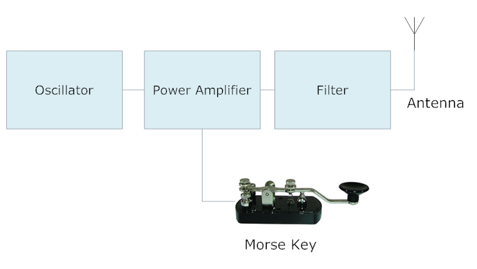
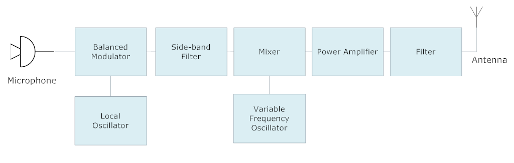

# 8. Transmitters

> TODO: Complete this chapter

## Definitions

## CW (Morse Code) Transmitter

- Block diagram of transmitter:

##### Description of transmitter:

- The **oscillator** generates the radio signal.
- The **power amplifier** boosts the signal that is generated by the oscillator.
- The **filter** removes any unwanted harmonics generated by the transmitter.

## AM (Amplitude Modulation) Transmitter

- TODO: Make block diagram of transmitter and write description

## SSB (Single Side-Band) Transmitter

- Block diagram of transmitter:

- The **local oscillator** generates the 455 kHz Intermediate Frequency (IF) signal.
- The **balanced modulator** mixes the 455 kHz signal with the audio signal to created a double side-band signal with a supressed carrier, at the IF frequency.
- The **side-band filter** helps to filter one of the side-bands of the signal coming from the balanced modulator. The side-band that is removed would depend on which side band the user wishes to transmit on.
- The **variable frequency oscillator** (VFO) is a frequency adjustable oscillator helps to generate the final RF frequency that the transmitter will transmit on.
- The **mixer** takes the filtered signal coming from the side-band filter, and mixes it with the signal from the VFO. The output will be a SSB signal at the frequency set by the user. 

