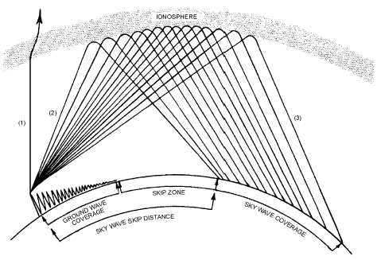
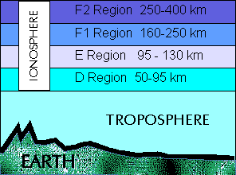
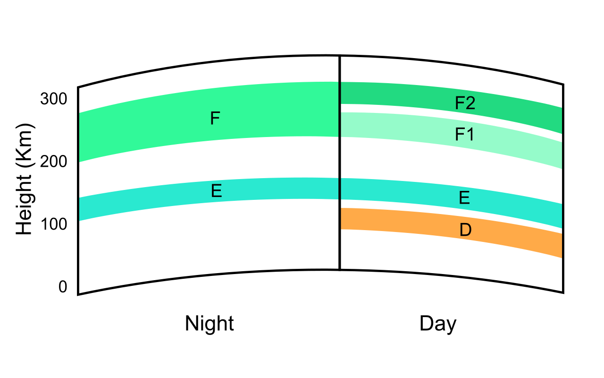

# 8a. Propagation

## Definitions

- **Propagation** is happens to the radio signal between it leaving the transmitter aerial and it arriving at the receiver aerial
- **Refraction** is the deflection of a ray of light etc when it passes obliquely from one medium (water, air, glass etc) to another
- **Sun Spot** appears as a dark patch on the sun and causes increased ionisation around our world
- **Skip distance** is the distance between the transmitter and the nearest point on earth where the signal is receivable after having been refracted back from the ionosphere
- **Fading** causes large changes in the strength of a signal at the receiver aerial due to the signal arriving via 2 or more paths
- **Automatic gain control (AGC)** is a closed-loop feedback regulating circuit, the purpose of which is to provide a controlled signal amplitude at its output, despite variation of the amplitude in the input signal
- **Selective fading** will occur when the refractive effect of the ionosphere varies with frequency
- **Critical Frequency** is the highest frequency signal that, when transmitted straight up, will be reflected (total refraction) back to earth at the same point
- **Maximum Usable Frequency (MUF)** is maximum frequency that can be used to communicate between two stated places. MUF includes path and time of the day.
- **Temperature inversion** happens in the atmosphere when warm air rises (due to smoke) and cold air is above ground

## Diagrams

- Skip distance, skip zone

  
  > Image credit: [Electrician training](http://electriciantraining.tpub.com/14182/css/Skip-Distance-Skip-Zone-84.htm)
- Ionosphere height

  
  > Image credit: [image](http://www.bibliotecapleyades.net/haarp/esp_HAARP_17.htm)
- Ionosphere day and night

  
  > Image credit: [Wikipedia](https://en.wikipedia.org/wiki/Ionosphere)

## Notes

### Ground wave

- simple case of the signal traveling across the ground (or sea) to the receiving aerial
- actual distance possible will depend on the conductivity of the terrain
- example:
  - best: over salty water
  - worse: over sandy desert
- distance:
  - `2MHz` travels `100s km`
  - `21MHz` travels `10km - 1km`

Low frequencies are so good for world wide communication. Why are they not used more often?
- The frequency is too low to carry the bandwidth of speech modulation
- Being low, there are not many frequencies available

### Ionosphere

*Radio waves are refracted by the ionosphere*

- The well known long distance (DX) Amateur Bands `14MHz, 16MHz, 21MHz, 24MHz, 29MHz`
- Variables:
  - *strength of the suns rays*
    - day / summer --> higher ionisation
    - night / winter --> lower ionisation
  - height, thickness and density of the ionosphere
  - position and density of the ionosphere dictate which frequencies will be refracted and by how much
  - *Sun Spot activity* varies over the years - peaking and dipping (troughing) every 11 years

| ionosphere layer | Position | Description |
| - | - | - | -
| D | `60km` - `85km` | - Absorbs rather than refracts radio waves   - Absorption is inversely proportional to the frequency
| E | `100km` - `120 km` | - Lowest ionised layer that can usefully be used for ionospheric propagation   - Refract (bend) radio waves during daylight hours, virtually disappears at night   - Does not normally result in vast distances of communication (100s of miles, not 1000s of miles)
| F | `140km` - `400km`     `150-200 kms` (`F1`) disappears at night| - Height varies from vary rare to non-existent   - Ionises very quickly at sunrise to reach a maximum just after midday   - decay is so slow that the ionised layer remains present all through the darkness hours   - `F2` layer is most important

### Sky waves

- sky waves can be single or multi-hop
- In multi-hop propagation, the radio wave is refracted back to earth where It is reflected up again
- This is the way to communicate over the longest distances; to the opposite side of the world

##### Skip distances

- actual skip distance depends on:
  - the time of day
  - season
  - frequency

| Frequency | Noon skip (km) | Midnight skip (km) |
| --- | --- | --- | --- |
| `1.9 MHz` | 0 | 0
| `3.6 MHz` | 0 | 0
| `7.1 MHz` | 0 | 500
| `10.1 MHz` | 350 | 1000
| `14.1 MHz` | 600 | 1600
| `16.1 MHz` | 1200 | Not possible
| `21.1 MHz` | 1300 | Not possible
| `24.9 MHz` | 1600 | Not possible
| `26.5 MHz` | 2000 | Not possible

#### Fading

- Both single and double hop sky waves are received but the path lengths are very different
- two (or more) signals are most likely to *arrive out of phase*
- At one moment the signals will add and a little later they will tend to cancel each other out
- A receiver with good "automatic gain control" (AGC) can greatly overcome the problems of fading
- Selective Fading
  - severe modulation distortion will take place
  - speech may become unreadable

#### Fade out

- A major flare eruption on the sun will rapidly increase the ionisation of the E layer
- Its absorption will dramatically increase for a period of up to two hours
- Many radio signals will suddenly disappear during this time

### Other types of Propagation

#### 1. VHF Propagation (above 30MHz)

- Don't get refracted by the ionosphere those going up, go on and on to get lost in space
- Signals tend to travel more or less in straight lines
- VHF aerials are usually designed to transmit the VHF signal in a narrow beam, parallel with the earth’s surface
- terrain becomes very important
- Tip: If you intend to operate on the VHF/UHF Amateur Bands you should try to live on top of a hill
- Obstacles can be an advantage as a reflection to the possible destination

#### 2. Tropospheric ducting

- Sometimes there might be a layer of warm air in the atmosphere above the cool air on ground
  - temperature inversion
  - smoke rises
- Temperature inversion will conduct VHF signals over long distance

#### 3. Aurora / Northern lights

- ionised waving curtain also reflects VHF radio signals
- The Northern Lights result from large solar flares on the Sun
- *Disadvantage* causes large Doppler frequency shift
- *Tip* makes Morse necessary rather than ghostly speech

#### 4. Meteor tail

- When meteors pass through the earths atmosphere they create short term ionised tails behind them
- It may last only for a few seconds but contacts over 2000KMs are possible
- *Disadvantage* Lasting only a few seconds
- *Tip* Speeded up Morse is usually sent and a tape recorder used at the receiving end to slow it down again

#### 5. Moon bounce

- requires high gain aerials
- high power sensitive receivers
- *Disadvantage* Moon is not an easy target to hit with a radio wave as it keeps moving

#### 6. Amateur satellites

- amateurs using satellites must follow them across the skies with their aerials
- *Disadvantage* They are constantly on the move relative to the earth in non geostationary orbits
- Unlike the "passive" moon an Amateur Satellite re-transmits the received signal on another Amateur Band
