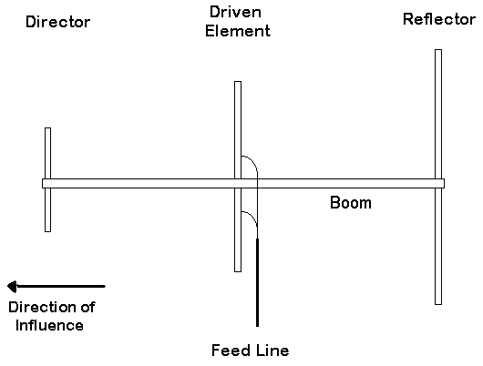
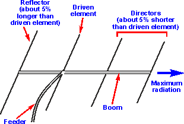
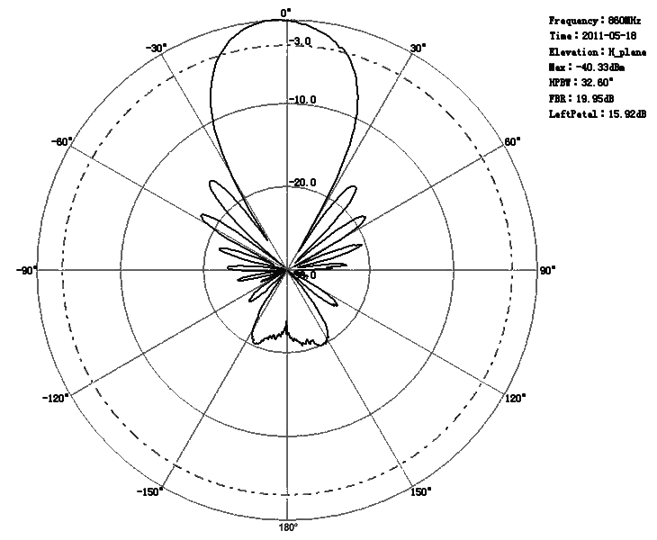
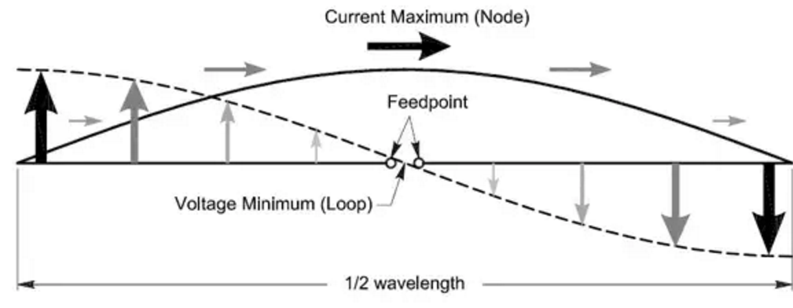
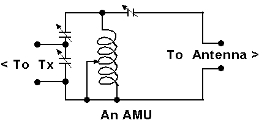

# 8c. Aerials and Feeders

## Definitions

- **Electromagnetic Wave** is created when radio frequency power from the *transmitter* causes a radio frequency current to flow in the *aerial*
- **Feeder** is the cable connecting the aerial to the radio
- **Half wave dipole** is a half wavelength wire cut in the middle and connected to a radio
- **Polar diagram** is drawn by joining together all the points of equal field strength
- **Tuned circuit** is an LC circuit, also called a **resonant circuit**, **tank circuit**
- **Reflector** is an extra wire, slightly longer than the dipole, placed parallel to it at about `λ/4` away
- **Director** is a shorter wire on the other side of the dipole that will further increase the directional qualities
- **Coaxial cable (coax)** has a centre conductor that is surrounded by insulation and a wire mesh screening
- **Screen** is usually earthed and this cable is known as a **unbalanced feeder**
- **Ribbon cable feeder** comprises of two parallel wires separated by an insulator
- **Balun** can also be constructed to change the impedance
- **Standing waves** occurs when there is the presence of both forward and reverse voltages & currents. If a feeder is incorrectly matched then some of the transmitted power will be reflected.
- **SWR** is defined as the ratio of the maximum radio-frequency (RF) voltage to the minimum RF voltage along the line. This in turn, tells you if the impedances between the load and source (transmitter) are matched.
- **Standing wave ratio meters (SWR meter or bridge)** will determine the ratio between the forward and the reverse powers within the feeder cable and can indicate if the aerial is correctly matched to the feeder.
- **Aerial Matching unit (AMU)** can improve this matching and can also (where necessary) perform the function of a balun when the impedance at the feed point of an aerial does not match the impedance of the of the feeder cable

## Diagrams

- Directional antenna

  
- Yagi antenna

  
  
- Yagi radiation patten

  

## Circuit diagrams

- Current-voltage distribution at antenna

  
- Tuned LC circuit

  
- Aerial Matching unit (variable LC)

  

## Notes

### Electromagnetic waves

- Vertical aerial will create an electromagnetic wave that is said to be **vertically polarised**
  - electric field will be *vertical*
  - magnetic field will be *horizontal*

### Types of Aerials

| | Aerials | Notes | Length | Impedance
| --- | --- | --- | --- | --- |
| 1 | Half wave dipole | A feeder of that impedance can be used to give a good match | `λ/2` with `λ/4` on each side | low impedance at the centre feed point (`70Ω` / `80Ω`)
| 2 | Ground plane | - The feeder cable is connected to the lower end and earth.   - The vertical aerial would normally be fed with coaxial cable from the radio.   - The inner is connected to the bottom of the aerial   - The outer screen is connected to earth (or ground plane wires or plate).| `λ/4` in vertical height |
| 3 | End Fed | An Aerial Matching Unit (sometimes referred to as a Aerial Tuning Unit) would normally be used at the feed point | length of the wire should *not* be an even number of `λ/4` | The AMU would be connected with `50Ω`, `60Ω` or `70Ω` coaxial cable
| 4 | Multiband | For the aerial to function well on several Amateur Bands, it can be electrically achieved if tuned circuits are inserted into the aerial wires | `2 x λ/4` | 
| 5 | Directional | - designed to concentrate the transmitted RF energy transmitting in one direction   - If another wire, slightly longer than the dipole, is placed parallel to and about `λ/4` away, then the aerial will have directional qualities. This extra wire is called a **reflector**   - Adding a shorter wire **director** on the other side will further increase the directional qualities. |
| 6 | Yagi | - frequently used at VHF and UHF   - Adding directors dramatically reduces the impedance of the feed point of the driven element   - In order to combat this, the dipole is replaced by a loop.| element spacing is typically `λ/4`
| 7 | Quad | - Have rod or wire elements that are formed into square loops   - Quad Aerial is compact and prevents high angle radiation | square loops with `λ/4` sides |

### Other concepts

- Feeder cables
  - connects radio to the aerial
  - can be coaxial or ribbon cable
  - typical impedance is `50Ω` / `70Ω`
  - *Advantage:* does not have to be installed clear of building and other structures
  - *Disadvantage:*
    - not cheap
    - high loss for the signals passing through it
- Ribbon cable
  - it can have a series of spacers, giving the appearance of a ladder or can have a continuous flat plastic spacing
  - wire spacing can range from `10mm` to `100mm`
  - gives impedance from about `70Ω` to `600Ω`
  - *Advantage:*
    - low loss
    - cheap
  - *Disadvantage:*
    - must be kept clear of walls and metal structures
- Feeder
  - balanced twin or unbalanced coaxial cable
  - characteristic impedance that is dictated mainly by its physical dimensions
  - connected directly to the transmitter
  - should match its output impedance
  - transmitter output impedance is usually `50Ω` or `75Ω`
  - A short circuit at one end of a `λ/4` cable (or odd number of `λ/40`) will appear to be an `∞` impedance as seen from the other end

### Balanced / Unbalanced

| Balanced | Unbalanced
| - | - |
| - feed-point of a dipole aerial   - twin feeder | - Aerial socket on a radio   - Coaxial cable

*Often necessary to "convert" from balanced to unbalanced*

- a `2:1` balun could be used to match a balanced aerial
- feed impedance of `100Ω`
- coaxial feeder cable of `50Ω` impedance

### Standing wave ratio (SWR)

- It is defined as the ratio of the maximum radio-frequency (RF) voltage to the minimum RF voltage along the line.
- The SWR can also indicate if an impedance mismatch has occured, and by how much. 
- An open or short circuit will result in an infinite SWR.
- If there is an impedance mismatch, it will result in an inefficient power transfer from source to load as the signal is reflected back towards the transmitting source.
- Thus, a good impedance match is key to achieving a maximum power transfer to the load, and thus generaly leads to more of your signal being radiated out.

### Standing wave ratio meters

- A terminating resistor, equal to the characteristic impedance of the cable, is connected across the far end of the cable
- A SWR meter is connected between the transmitter and the feeder cable
- *Low SWR reading* indicates low power (radio frequency) is then transmitted
- *High SWR reading* would indicate that there was likely to be a fault in the feeder cable (visual inspection required)
