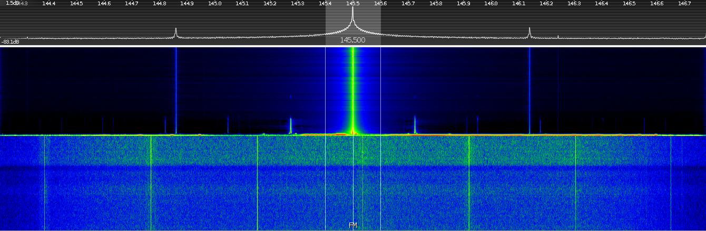
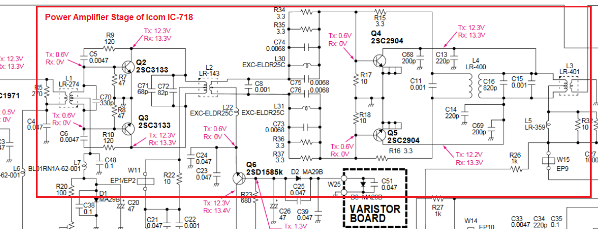

# 9. Power Amplifier

> TODO: work in progress

## Definitions

- **Power Amplifier** takes the output from the exciter which is usually very low and amplifies the signal before passing it to the aerial
- **Modulation** is the process of impressing speech on to the carrier wave
- **ATU** is aerial tuning unit is a device connected between a radio transmitter or receiver and its antenna to improve power transfer between them by matching the impedance of the radio to the antenna’s feedline.

## Diagrams

- Spectrogram and waterfall  of a transmitted signal on 145.5 MHz, showing harmonics

## Circuit diagrams

- Circuit of Icom IC-718's Power Amplifier

## Graphs

## Notes

### Power Amplifier

- no frequency change within a P.A.
- very important to ensure that self-oscillation does not take place
- Class of oscillation decided based on the modulation scheme (Class C for FM, AB for SSB)
- Harmonics must be suppresed to avoid unintended interference
