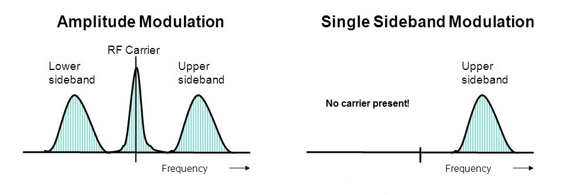

# 10. Modulation

## Definitions

- In **Frequency Modulation**, the speech causes the frequency of the carrier to go up and down
- **Narrow Band Frequency Modulation (NBFM)** means the bandwidth of an transmission must be no more than the `6kHz` permitted on AM
- The **frequency of the modulating frequency** controls the rate at which the carrier swings up and down from nominal.
- **Capture effect**, or **FM capture effect**, is a phenomenon associated with FM reception in which only the stronger of two signals at, or near, the same frequency or channel will be demodulated
- **CW** is "Carrier Wave" and sometime for "Continuous Wave"
- **BFO** Beat Frequency Oscillator
- **Splatter interference** is caused by over-modulation of a transmitter
- **Spurious emission** is any radio frequency not deliberately created or transmitted, especially in a device which normally does create other frequencies. 
- **Key Chirp** is a short frequency shift in the transmitter as it is being "pulled off" slightly off frequency due to the keying or instability of the oscillator. 
- **Key Click** are generally undesired "clicks" or "thumps" generated by a CW transmitter as the key is put down or let up due to the quick rise and fall times of the transmitted signal.

## Diagrams

- AM and FM

  

- Spectrogram of AM vs SSB

  

## Circuit diagrams

## Formula

- Lower sideband = `Fc - Fm` where `Fc` is the carrier frequency, `Fm` is the modulating frequency
- Upper sideband = `Fc + Fm` where `Fc` is the carrier frequency, `Fm` is the modulating frequency
- `Modulation index = Deviation from carrier centre frequency / Audio frequency producing this deviation`
- `Deviation Ratio = Maximum Deviation of the Carrier / Maximum modulating frequency`

## Graphs

## Notes

### Amplitude Modulation (Double Side Band (DSB))
- Starts with a simple carrier wave.
- The **amplitude of the modulating signal** (eg. your voice) **varies the amplitude** of the carrier wave. (See image above)

### Problems with AM

- Not an efficient method of communication as the "speech content" of the total signal is small.
- The signal has two side bands, upper and lower, approximately +/- 3 kHz from the carrier respectively.
- **Both side bands carry the same information.**
- Hence the **RF power is split** between the carrier, upper and lower sidebands.
- Thus, it is very inefficient power wise and bandwidth wise too!

### Single Side Band (SSB)

- Improved form of AM modulation.
- Supresses the carrier signal and also one side band too!
- More efficient as power is only given to one side band.
- Less bandwidth needed on air.

### Over modulation

- Avoid over modulation
- Distorting the amplitude modulated signal and cause undue bandwidth and interference
- This results in spurious emissions by the modulated carrier, and distortion of the recovered modulating signal
- If over-modulation does occur the carrier is chopped up and the modulation no longer resembles its modulating signal
- Signal will have an increased bandwidth
- Signal will be rich in unwanted harmonics

Prevent over-modulation:

- an indication is given when the depth of modulation exceeds, say, 80%
  - monitoring the output with an oscilloscope or by a modulation meter
  - a lamp or LED lights when a predetermined level is exceeded
- By automatic means, whereby the modulating signal is prevented from exceeding an amplitude that would result in over-modulation

### Frequency modulators

- Most important component is the variable capacitor diode:
  - connected across the tuned circuit of an oscillator
  - reverse biased to a linear part of the Volts/Capacitance curve
  - A conducting diode would damp the tuned circuit and may stop the oscillator

### Interference in AM / FM

- unwanted spikes of interference modulating the amplitude of the carrier
- the clipper can remove all of the unwanted amplitude modulation and leave the carrier intact
- changing frequency of the carrier contains all the necessary information to give an undistorted
interference free audio output

### Weak FM

- an FM signal has to be reasonably strong to attain the advantage of "interference free reception"
- a very weak FM signal, will sound much noisier than an AM signal of the same strength

*An FM signal, having **constant amplitude**, is less likely to cause Interference to nearby television and radio receivers.*

### Morse transmission

- Simple transmitters for `A1A`:
  - Consists of an RF oscillator and a power amplifier stage.
  - When the Morse key is pressed `down` a carrier (a single frequency) is `transmitted`
  - When the Morse key is `released` then no carrier is transmitted, and thus no signal at the receive end.
  - This signal requires a receiver with a BFO (Beat Frequency Oscillator) so that you can hear the "dits" and "dahs" of the Morse Code
  - Oscillator must **should not** be keyed as this causes "chirping"
  - Chirp will be heard at the receiver end as a slight change in audio frequency too!
  
- Complex transmitters for `SSB`:
  - send a carrier continuously but connect the Morse Key to an audio oscillator
  - When the Morse Key is `pressed` the carrier is Amplitude modulated with this audio tone
  - When the key is `released` the tone is switched off but the carrier wave continues
- `A2A`
  - leave the audio tone modulating the carrier all the time
  - switch the whole modulated signal on and off using the Morse Key
  - Where a tone is added (often referred to as a "sub carrier") then this is given the code A2A
  - an A2A transmission uses a modulating signal which is keyed by a tone or sub-carrier resulting in a double side band amplitude modulated signal
  - can be received with an ordinary receiver, with out the need for a BFO
