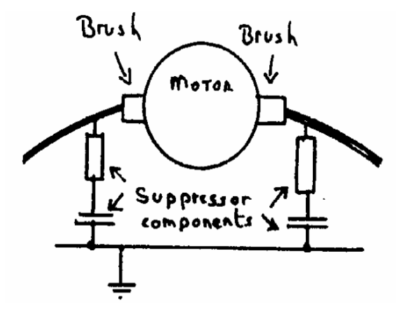
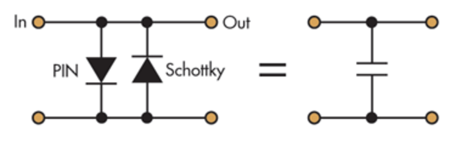

# 10A. EMC

## Definitions

- **Electromagnetic Compatibility (EMC)** is the ability of equipment to function satisfactorily in its electromagnetic environment without introducing intolerable disturbance to anything in that environment
- **Noise limiter** would comprise of two back to back diodes connected across the headphone circuit
- **Field strength** is measured in `Volts` (or `µV`) induced into each metre of receiving wire

## Diagrams

- Motor with suppressor

  
- Simple noise limiter circuit

  

## Circuit diagrams

## Formula

- `Field strength = 7 x (square root of the ERP)` where `Field strength` is in `V/m`, `square root of ERP` is Effective Radiated Power

## Notes

### Example resolution

- Electric motor
  - the carbon brushes sparking on the commutator and radiating interference from the wiring
  - *solution:*
    - each motor was manufactured with a suppressor fitted
    - this damped the spark and greatly reduced its annoying radiation
- Headphone circuit
  - *solution:*
    - spike resulting from a distant spark would have a much greater amplitude and 'switch on' the diodes
    - this would chop off the top of the spike making it less objectionable to the listener
- Radio transmitters
  - intentionally radiates an electromagnetic wave
  - Modern domestic radios, TVs and Hi-Fi's are not always as efficient at 'ignoring' local electromagnetic transmissions as were their valve predecessors
- Television
  - quite possible to manufacture TV sets that are immune to strong electromagnetic fields
  - most TV's do not have to operate in the presence of a strong electromagnetic field
  - to keep their production casts to a minimum they omit any components not absolutely necessary under normal operating conditions

### Precaution with Radio

Amateur radio station

  - transmitting aerial should be in the clear
  - as far possible from anyone’s TV (and aerial) or Hi-Fl equipment
  - efforts should be made to minimize the coupling between the transmitting stem and the TV coax by not having the two running parallel
  - would be unwise to install a vertical amateur aerial anywhere near where the TV coax runs up the wall to the roof

How can an Amateur transmission get into a TV or Hi-Fi?

- via aerial coaxial feeder cable
- via mains cable
- directly into TV/Hi-Fl chassis
- via loud speaker leads (Hi-Fl)

End Fed Aerials

- Steps should be taken to avoid creating strong electromagnetic fields within the house in order to prevent it being picked up by the house electrical wiring
- At certain frequencies the internal portion of the end fed wire could create a very strong electromagnetic field within the house
- most TV's and Hi-Fl's have wooden or plastic cases and therefore have no inherent screening
- *solution*:
  - best not to use an 'end fed aerial' unless the aerial tuning unit can be fitted just inside the outside wall
  - treat plastic to give it screening qualities, but it is costly

### Earth

- A good RF earth must have a low impedance
- Ideally the earth cable should be:
  - short:
    - care must be taken that it is not equal to a `quarter wavelength`, or an odd number of `quarter waves` at the frequencies to be used.
    - transmitter that is 'earthed' via this length will be at a very high impedance point
  - straight
  - stout
  
Warning: **NEVER** in any circumstances should the mains Earth be used as a RF ground. Not only will it not work effectively, it can be dangerous in the event of an earth fault.

### Field strength

- strength of a field (E) reduces as you move away from transmitting aerial
- reduce the transmitted power to reduce field strength
- it is good practice to use only enough power necessary for adequate communication
- quite easy for several fairly low power stations to operate around the same frequency
- just one amateur using unnecessarily high power renders a whole block of frequencies unusable for everybody else

### Home equipments

TV

- TV sets have two time-base oscillators:
  - (horizontal) line timebase
  - (vertical) frame timebase
- a 625 line system the line oscillator runs at `15.625 kHz`
- shape of the waveform is like a 'sawtooth'
- waveform is very rich in harmonics
- can heard throughout the Amateur Bands up to at least `30MHz`
- pitch of the buzz will vary in sympathy with changes in the TV picture
- TV time-base radiation can often be reduced by fitting the usual filters in the:
  - TV aerial lead
  - TV mains lead

Computers

- Tiny circuits are either on or off, `1` or `0`
-  switch continuously and rapidly resulting in many nasty squares
- 5 Volt square waves
- rich in harmonics
- create 'hash' throughout the Amateur Bands right up to at least `200 MHz`
- all small computers are, unfortunately, built in untreated plastic boxes
- unscreened ribbon cable acts, unwittingly, as an aerial and ensures that the hash is spread over a wider neighborhood

Older equipments

- Worn thermostat contacts
- fluorescent strip lights

#### Power measurement in your log book

- present license now requires the log entry to include the output 'power'
- Most power meters are calibrated directly in `Watts` rather than `dB`

| Decibel | Watt
| --- | --- 
| 9dB | 6W 
| 10dB | 10W
| 14dB | 25W
| 15dB | 32W
| 16dB | 40W
| 20dB | 100W
| 22dB | 160W
| 26dB | 400W
| 30dB | 1000W
