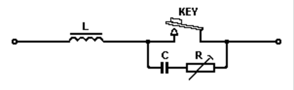
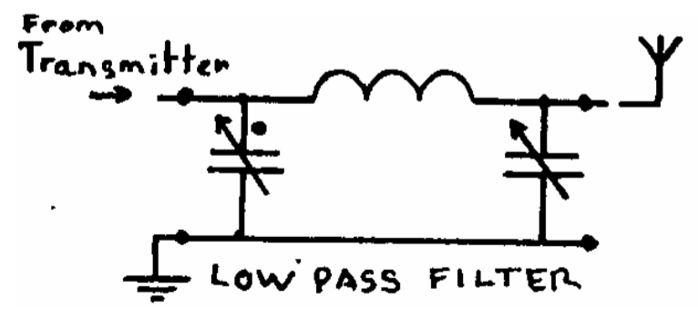
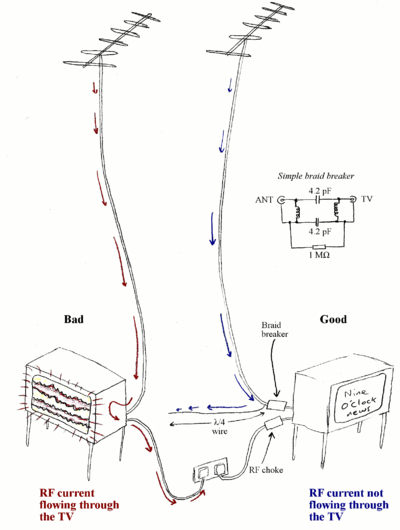

# 11. Interference

## Definitions

- **Interference** may be due to faults and/or deficiencies in either the transmitter or in the receiver or both
- **Blocking** happens if the receiver is situated close to a transmitter when the transmitter Is operating
- **Key clicks** are generally undesired "clicks" or "thumps" generated by a CW transmitter as the key is put down or let up.
- **Chirp** is a signal in which the frequency increases (up-chirp) or decreases (down-chirp) with time.
- A **braid-breaker** is a filter that prevents television interference
- **Ferrite bead** or ferrite choke is a passive electric component that suppresses high frequency noise in electronic circuits.

## Diagrams

## Circuit diagrams

- Key click filter

  
- PI-network circuit

  
- Braid breaker

  

## Notes

### Receiver problems

- Blocking
  - if the receiver is situated close to a transmitter
  - receiver is blocked when the transmitter is operating
  - receiver, although tuned to another frequency, becomes overloaded and it will no longer 'hear' the wanted station
- Second channel interference
  - Most receivers are of the superheterodyne type and reply on mixing
  - for a given **Local Oscillator frequency** and **Intermediate Frequency** there will two frequencies
  - frequency of the unwanted station will be 2X the IF away from the wanted frequency
  - RF stage of the receiver should be designed to reject the 'second channel'
- Local Oscillator Harmonics
  - If the LO in the receiver generates harmonics these will cause unwanted mixing products
  - unwanted stations could be received
- Detection
  - If the receiver or Hi-Fi is not well screened then the RF from a nearby transmitter may enter and be detected by any non-linearity in the audio stages
- IF Breakthrough
  - If a receiver has an Intermediate Frequency in an Amateur Band then any transmission on that frequency might be received where ever the receiver is tuned.
  - very important that the high gain IF stages of a receiver are well screened

### Resolution

- ensure that the receiver does not get an extremely strong signal from the Amateur Transmitter
- TV / VHF receivers: ensure that the outer of the coax cable does riot act as an aerial for the amateur transmissions
- A filter (braid breaker) can be connected in the coax near to the TV or hi-fi
  - screen is then no longer connected directly to the receiver
  - loss at UHF TV and VHF hi-fi frequencies is very low
  - This filter should be fitted about one Metre along the cable from the receiver
  - Signals picked up on the outer of the cable can also be much reduced by winding it several times through a ferrite ring

### Deficiencies

1. **Receiver deficiencies**
  - internally
    - add inductance to the base circuit of a transistor
    - passing the base connection through a small ferrite bead
  - externally
    - A **rejector circuit** is a parallel tuned circuit and at its resonant frequency it is a high impedance. Therefore it is connected in series with the aerial wire
    - The **acceptor** is a series tuned circuit and it will have a low impedance at resonance. It is therefore connected across the aerial and earth connection to '”short circuit1” the unwanted frequency
- **Transmitter deficiencies**
  - A Morse (CW) transmitter, although simple, is capable of producing clean harmonic free transmissions
  - Morse key is up: no output
  - Morse key is pressed: a full output until it is released and the output drops abruptly
  - sudden changes (arrowed) will generate clicks that are rich in harmonics
  - annoying clicks will be heard, not only on the transmitted frequency, but also on its harmonics
  - *solution*:
    - wave shape must be rounded to remove those harmonic laden sharp corners
    - a key click filter comprises of a coil, capacitor and a resistor wired into the Morse key
      - coil prevents a sudden build up of current when the key is pressed
      - decay of the current is prolonged by the capacitor and the resistor when the key is released

### Types of Interferences

1. Harmonic transmission
  - all waveforms apart from sine waves contain harmonics
  - important to ensure that any harmonics produced by a transmitter are not actually transmitted
  - harmonics must not reach the aerial
- Harmonic reduction
  - A PI-network is connected between the aerial socket of the transmitter and the aerial wire
  - very effective in reducing harmonics:
    - 4X better than a simple parallel tuned circuit for reducing the second harmonic
    - 9X better than at the third harmonic
  - frequency multiplier stages of the transmitter should be carefully screened to ensure that no 'unwanted' frequencies escape
  - Fit a low pass filter in the transmitter output
  - important to have good earthing and de-couple all the power leads
- Over modulation
  - must be avoided in an amplitude modulated transmitter
  - transmitter should be designed so that over modulation cannot occur
  - an indicator should be fitted to show when 100% modulation is being approached
- Parasitic (or spurious) Oscillations
  - Certain stages of a transmitter may break out into self oscillation at a an apparently random frequency
  - Low Frequency
    - Amplifiers may burst into oscillation that cannot be sustained
    - Transistors that are used in Radio Frequency amplifiers usually have an unwanted, high gain at audio frequencies
  - Signal Frequency
    - Amplifiers may oscillate at the frequency they are intended to amplify
    - an avoided by ensuring adequate screening
    - avoided with a change in the component layout
  - High Frequency
    - usually at VHF
    - Valve power amplifiers suffer from this problem
    - resolved by adding a low value resistor or a small coil at the grid tag
    - difficult to see which of the components have "unintentionally" formed a tuned circuit at VHF
    - even a straight piece of wire has some inductance at VHF
- Chirp
  - A Morse transmitter should be designed to maintain a constant frequency
  - If the Variable Frequency Oscillator (VFO) or crystal oscillator is not adequately buffered or the power supply adequately stabilized then the frequency may shift during the "key down" period

Unwanted frequencies

- All the unwanted products must be attenuated to ensure that they do not appear at the output to the aerial
- Ensure unwanted frequencies do not leak out
- Also possible that unwanted frequencies are being produced by non-linear devices outside the transmitter
