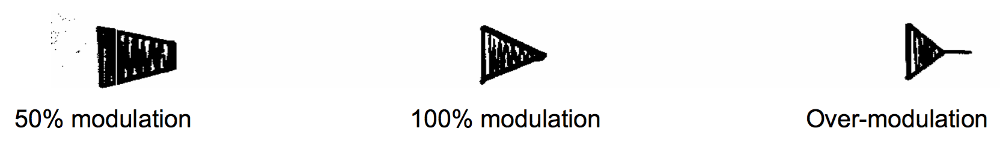
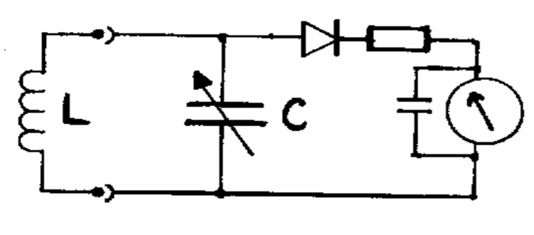
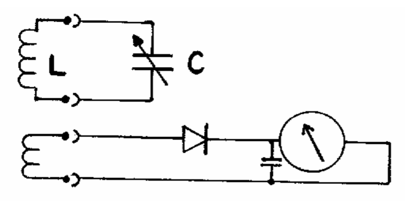

# 12. Meters

## Definitions

- **Cathode Ray Oscilloscope** / **CRO** / **scope** is a type of electronic test instrument that allows observation of constantly varying signal voltages, usually as a two-dimensional plot of one or more signals as a function of time
- **Absorption wave meter** is a simple electronic instrument used to measure the frequency of radio waves
- **SWR / VSWR** (voltage standing wave ratio) meter measures the standing wave ratio in a transmission line. The meter can be used to indicate the degree of mismatch between a transmission line and its load (usually a radio antenna), or evaluate the effectiveness of impedance matching efforts.

## Diagrams

- Modulation

  

## Circuit diagrams

- Absorption wave meter circuit 1

  
- Absorption wave meter circuit 2

  

## Formula

- Average DC of peak AC = `0.637` * peak AC
- Depth of modulation = `(A - B) / (A + B)` where `A` is maximum envelope height, `B` is minimum envelope height

## Notes

### Different Types

1. **Moving coil meter**
  - Used for direct current / voltage only
  - For AC the pointer will vibrate at 0
- **AC at low frequency**
  - the current is rectified before it passes through the meter coil
  - many meters use a metal oxide full wave bridge rectifier
  - shunts & multipliers are then added to give various AC ranges
- **AC at high frequency**
  - diode bridge will have too much self-capacitance
  - can be reduced by using special low capacitance diodes
  - better to use thermocouple meter, hot wire ammeter, oscilloscope
- **Thermocouple**
  - a small voltage is generated when two different metals are joined together
  - Voltage generated is proportional to the temperature at the joint
  - Radio Frequency (RF) current to be measured is passed through a heater wire that is close to one junction
  - Thermo-couple meter is slow to react but will indicate RMS values, whatever the waveform
- **Hot wire ammeter**
  - RF current is passed through a wire that is suspended between two fixed points
  - current warms up the wire and causes it to expand
  - expansion is used to mechanically move the pointer of a meter
  - wire is kept under tension by a little spring
  - as it relies on the heating effect, will indicate RMS that is independent of frequency
- **Cathode Ray Oscilloscope** (CRO or "scope")
  - similar to thermionic valve
  - In the CRT (cathode ray tube) the stream of electrons is focused (by focus anode) into a narrow beam that strikes a phosphor coated screen
  - point on the screen "hit" by these electrons gives off light
  - electric field is set up between the deflection plates
  - plates:
    - plates that deflect the beam vertically are called the "Y" plates
    - plates that deflect the beam horizontally are called the "X" plates
- **Absorption wave meter** circuit types
  - Circuit 1
    - has the disadvantage that the tuned circuit (L & C) would have a low Q
    - they are damped by the diode and meter circuit
  - Circuit 2
    - overcomes this problem by having a second coil to couple the signal into the meter circuit
    - coils act like a step down transformer and matches the high impedance L & C to the low impedance meter circuit
  - supplied with several plug-in coils so that a wide range of frequencies are covered
  - dial, fitted to the tuning capacitor, may have all the ranges marked directly or, simply, a `0` to `100` logging scale
  - frequency meter of this simple type would often cover `1MHz` to `100MHz` in several ranges
  - absorption wavemeter gives a low accuracy measurement of frequency
  - it is adequate to ensure that a transmitter is selecting the correct oscillator harmonic
  - often used when adjusting a transmitter by ensuring that the correct harmonic or mixing product, is selected at each stage
- **Digital Frequency Meter**
  - the counter actually counts the number of cycles (of the frequency to be measured) that reach it during the time that the gate is open
  - not practical to make a 1Hz oscillator (to control the gate)
  - low frequency is obtained by a crystal oscillator running at a much higher frequency, say `1MHz`
  - `1MHz` is then passed though a series of "divide by ten circuits"
  - gate could be open for `10sec`, `1sec`, `0.1sec`
  - only as accurate as crystal controlled oscillator
    - very important to ensure its frequency does not drift
    - part of the circuit is usually enclosed in a temperature controlled compartment
  - DFM could be used for checking:
    - Oscillator (VFO or crystal)
    - Frequency output of each stage
    - Frequency of the final output of a transmitter, but not if the transmission is SSB or deeply modulated AM
  - A frequency counter should not be used to check that a transmitter is using the correct multiplication factor
  - should first be done with a simple absorption wavemeter

### Modulation

#### Depth of Modulation

- Modulate the transmitter with a sine wave
- Connect the transmitter to a suitable dummy load and connect the CRO Y plates across it

#### Method 1: modulation depth

- apply the CRO's own timebase to its X plates
- modulation envelope will be displayed
- shows a high frequency carrier wave whose amplitude follows the shape of the modulating signal
- maximum (A) and the minimum (B) dimensions are them measured
- CRO display does not need to be calibrated as it is just the ratio of A and B that is used in the depth of modulation calculation

#### Method 2: modulation depth

- time-base is disconnected from the X plates of the CRO
- replaced by a proportion of the audio modulating signal
- This will give a trapezium display on the CRO screen

### Dummy loads

- When setting up (tuning up) or testing a transmitter, it is important that minimum interference is caused to other stations
- most of this work should be done with the transmitter not connected to the aerial
- Aerial must be disconnected and power must be suitably absorbed
- dummy load must be of an impedance to match the transmitter output usually `50Ω` / `75Ω` for handling `~100W`
- construct a `500Ω` dummy load from `10 X 50Ω` in parallel, with each resistor rated at `10W`
- possibly for a lower rated resistor if they are immersed in oil
