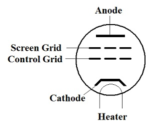

# 12. Valves (or tubes)

## Definitions

- **Diode Valve** is a valve having two electrodes (Cathode and anode)
- **Triode Valve** is a valve having three electrodes (Cathode, anode and control grid)
- **Tetrode Valve** is a valve having four electrodes (Cathode, anode, control grid and screen grid)
- **Pentode** is a valve with five electrodes (Cathode, anode, control grid, screen grid and suppressor grid)
- **SWR** is defined as the ratio of the maximum radio-frequency (RF) voltage to the minimum RF voltage along the line. 

## Diagrams

- Valve

  
- Triode

  
  
- Tetrode

  
  
- Pentode

  

## Graphs

- Grid voltage

  

## Notes

### Diode Valve

- By heating a metal, electrons on the surface of the metal become very agitated and electrons will escape from its surface.
- A diode is constructed with two
- inner tube (cathode) has a heater wire threaded through it
- outer tube is the anode and is connected to a high positive voltage, say, `150 Volts`
- cathode is coated with Barium Oxide and made very hot
- heated by a heater wire (element or filament)
- liberated negative electrons are attracted to the Anode because It is at a positive potential
- Like a semiconductor diode, reversing the polarity of the diode blocks current flow since electrons will not escape from a positive cathode

##### Amplification

- To amplifiy, there has to be a means of controlling the flow of electrons from the cathode to the anode.
- This is achieved by adding a wire mesh (grid) between the cathode and the anode
- The grid is widely spaced so it does not "physically" impede the electron stream
- When a negative signal is applied to the grid, it will repel some of the negative electrons and therefore reducing electron flow from cathode to anode.
- Conversely, applying a positive signal to the gride causes more electrons to be attracted, and thus, more electrons reach the anode
- Thus, since applying a small current can control a larger current flow, the valve can thus amplify the signal.

#### Valve as an amplifier

- DC anode current has an 'amplified' AC (audio) superimposed on it
- varying current develops both DC and AC voltage across R1
- AC is picked off by C2 and will be an amplified version of the input signal
- 5 electrodes:
  - Anode,
  - Cathode
  - Control Grid
  - Screen Grid
  - Suppressor Grid

Advantages:

- A valve will withstand a certain amount of 'mistreatment' during tuning
- A valve is more easily matched to the aerial circuit
- A poor SWR will tolerated by a valve

Disadvantages:

- Requires a high voltage power supply
- Precautions necessary to avoid electric shock
- Valves wear out and require replacement which is likely to be expensive
- Less convenient for 'mobile' operation
