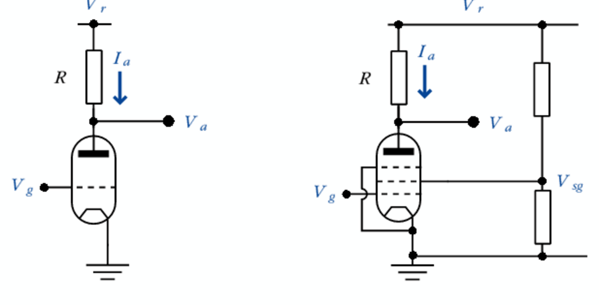
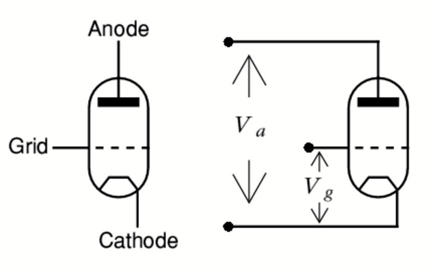
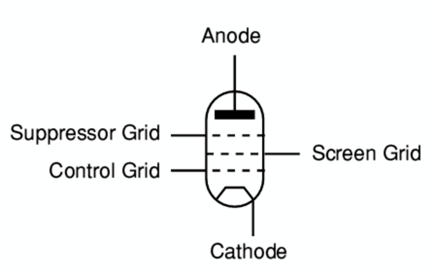
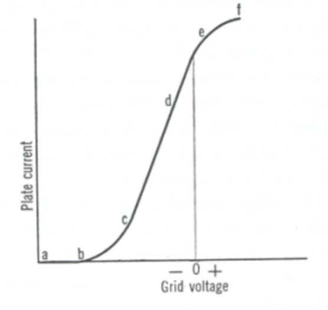

# 12. Valves

## Definitions

- **Radio Thermionic Valve** allow flow of electrons in one direction only
- **Triode Valve** is having three electrodes
- **Pentode** is a valve with 5 electrodes
- **SWR** is defined as the ratio of the maximum radio-frequency (RF) voltage to the minimum RF voltage along the line

## Diagrams

- Valve

  
- Triode

  
- Pentode

  

## Graphs

- Grid voltage

  

## Notes

### Thermionic Diode Valve

- By heating the metal (called the cathode) the electrons become very agitated and many of the electrons escape from its surface
- A diode is constructed with one tube inside another
- inner tube (cathode) has a heater wire threaded through it
- outer tube is the anode and is connected to a high positive voltage, say, `150 Volts`
- cathode is coated with Barium Oxide arid made very hot
- heated by a heater wire (element or filament) at `6.3V AC` passing through its centre
- liberated negative electrons are attracted to the Anode because It is at a positive potential

##### Amplification

- there has to be a means of controlling the flow of electrons from the cathode to the anode
- achieved by adding a wire mesh (grid) between the cathode and the anode
- mesh is wide spaced so it does not "physically" impede the electron stream
- The negative grid will repel some of the negative electrons and therefore cut down their flow from Cathode to Anode

#### Valve as an amplifier

- DC anode current has an 'amplified' AC (audio) superimposed on it
- varying current develops both DC and AC voltage across R1
- AC is picked off by C2 and will be an amplified version of the input signal
- 5 electrodes:
  - Anode,
  - Cathode
  - Control Grid
  - Screen Grid
  - Suppressor Grid

Advantages:

- A valve will withstand a certain amount of 'mistreatment' during tuning
- A valve is more easily matched to the aerial circuit
- A poor SWR will tolerated by a valve

Disadvantages:

- Requires a high voltage power supply
- Precautions necessary to avoid electric shock
- Valves wear out and require replacement which is likely to be expensive
- Less convenient for 'mobile' operation
