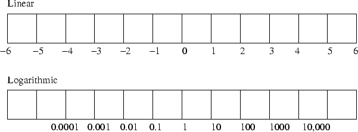

# 14. Transmitter Measurement

## Definitions

- **Decibel** is used as a comparison. It can either be a comparison between two measurements or between one measurement and a standard unit.
- **0 dBW** does not mean there is zero power, but it means the power is exactly the same as the reference, `1 Watt`, in this case
- **3dB down** is the bandwidth usually quoted to be the frequencies between the half-power points
- **Two Tone Generator** comprises two audio oscillators whose out puts are combined into a single output to be connected to the microphone input of the transmitter under test
- **Mean power output** of an SSB transmitter fed with two tones will be 50% of the Peak Envelope Power
- **Effective radiated power (ERP)** is an IEEE standardized definition of directional radio frequency (RF) power transmitted from a theoretical half-wave dipole antenna
- **Peak envelope power (PEP)** is the highest envelope power supplied to the antenna transmission line by a transmitter during any full undistorted RF cycle or series of complete radio frequency cycles
- **Net** happens when more than two Amateurs are in conversation over the radio
- **Radio transeiver** is a combination of a radio transmitter and a radio receiver
- **PTT (Push To Talk)** or **MOX (Manually Operated Transmit)** or **VOX (Voice Operated Transmission)** are 3 different types of modes to change from listen to speak (receive to transmit)

## Diagrams

- Log vs linear scale

  

## Formula

- `Gain = 10 log (output power / input power)` where `Gain` is in `dBW`, `output power` and `input power` is in `Watts`
- `Gain = 20 log (output voltage / input voltage)` where `Gain` is in `dBV`, `output voltage` and `input voltage` is in `Volts`
- `Gain = 20 log (output current / input current)` where `Gain` is in `dBV`, `output current` and `input current` is in `A`
- `Gain = Gain(1) + Gain (2) - Cable loss` where `Gain` is total gain of 2 amplifiers put together in series one after another
- `dBW = 10 log Watts`
- `3db down on X = X/2` where `X` is power in `Watts`

## Notes

### Decibel

- It can either be:
  - comparison between two measurements
  - comparison between one measurement
  - standard unit
- `BEL` was named after the inventor of the telephone Alexander James Bell
- it was found that this unit was too large, so it was divided by ten
- Hence deci Bel and is usually abbreviated to `dB`
- human ear operates in a logarithmic fashion
- Decibel therefore follows a logarithmic law
- `3dB` is doubling of power
- `-3dB` is halving of power
- *Advantage:* Losses and gains can be added / subtracted
- decibel is not just used for power comparisons and measurements but current and voltage too
- Decibels are often used as the scale for response measurements

#### Examples of dBW values

| dBW | Watts
| --- | ---
| `-9dBW` | `0.125 Watts` (or `125mW`)
| `-6dBW` | `0.25 Watts` (or `250mW)`
| `-3dBW` | `0.5 Watts` (or `500mW`)
| `0dBW` | `1 Watts`
| `+3dBW` | `2 Watts`
| `+6dBW` | `4 Watts`
| `+9dBW` | `8 Watts`
| `+12dBW` | `16 Watts`

- `+dBW `is a power greater than the reference
- `-dBW` is a power less than the reference

#### Watts and dBW conversions

- `dBW = 10 log P`
- `P = 10 ^ (dbW/10)`

| dBW | Watts
| --- | --- |
| `-20 dBW` | `10mW`
| `0dBW` | `1W`
| `3dBW` | `2W`
| `6dBW` | `4W`
| `9dBW` | `8W`
| `10dBW` | `10W`
| `13dBW` | `20W`
| `14dBW` | `25W`
| `15dBW` | `32W`
| `16dBW` | `40W`
| `20dBW` | `100W`
| `22dBW` | `160W`
| 26 `dBW` | `400W`
| 30 `dBW` | `1KW`
| 40 `dBW` | `10KW`

#### Ratios

| Amount | dB
| --- | --- |
| 2X | `3dB`
| 4X | `6dB`
| 8X | `9dB`
| 10X | `10dB`
| 100X | `20dB`
| 1000X | `30dB`

### Amplitude modulation

- fully amplitude modulated by a sine wave audio tone
- radio frequency is very high compared with the audio frequency
- individual RF cycles may merge into each other on the screen and just appear as a green "modulation envelope"
- carrier now varies between zero and twice the amplitude of the original (unmodulated) carrier

### Single Side Band

- SSB transmission only contains one side band
- other sideband has been eliminated and the carrier has been suppressed
- very important to ensure that the various frequencies contained in the remaining sideband do not inter-modulate (mix) with each other
- other unwanted frequencies (intermodulation products) would be generated and transmitted
- very undesirable and must be avoided at all costs otherwise considerable interference will be caused

### Two tone test

- Both of the frequencies must be in the normal microphone input frequency range
- The tones should have the same amplitude but must not be harmonically related
- `700Hz` and `2kHz` would be suitable frequencies

three main types of radio communication:

- Speech - via microphone
- Morse  - via Morse key or keyer (automatic or semi-automatic)
- Digital - via keyboard on teleprinter or computer Procedures for each of these types will be explained.
