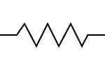
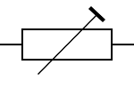

# 2. Basic electricity

> Refer to SARTS Notes [Lesson 1](http://www.sarts.org.sg/rae/Les1.pdf) and [Resistors](http://www.sarts.org.sg/rae/RESISTORSL1app.pdf)

## Definitions

- **Law of the Charges**: Like charges repel and unlike charges attract
- **Electricity** is electron flow in one direction
- **Insulators** do not conduct electricity as their electrons are tightly bound to their nucleus
- **Conductors** are materials in which the electrons are loosely bound
- **Primary cell** produces an electrical voltage by means of a non-reversible chemical reaction
- **Secondary cell** uses a reversible chemical reaction
- When two points in an electrical circuit do not have the same voltage they are said to have **p.d. (potential difference)**
- **E.M.F. (Electro-motive force)** is electrical pressure from a supply of cell or a generator
- **Wattage rating** is the value of resistance
- **Laws of magnetism** states that like poles repel and unlike poles attract
- **Maxwell’s right hand corkscrew rule** gives the direction of this field: If a right hand corkscrew moves forward in the *direction of the current* then its rotation will indicate the *direction of the magnetic field*.

## Units of measurement

- `Coulomb` or `C` is the quantity of electricity. Symbol of charge is `Q`
- `Ampere` or `A` is the unit of current flow. Symbol of current is `I`
- `Voltage` or `V` is the unit of electrical pressure
- `Watt` or `W` is the unit of power dissipated
- `Ohms` or `Ω` is the unit of resistance

### Resistor values

- `2.4 Ω` is `2R4`
- `3.3 KΩ` is `3K3`
- `5.6 MΩ` is `5M6`

## Circuit symbols

- resistor symbol (ANSI)

  
- resistor symbol (IEC)

  
- variable resistor symbol (adjusted during operation)

  
- preset variable resistor symbol (adjusted by a screwdriver when the equipment is being aligned or maintained)

  

## Formula

- `Q = It`, where `Q` is charge is `Coulomb`, `I` is current, `t` is time in `seconds`
- `V = RI` where `V` is the voltage, `R` is the resistance, `I` is the current
- `P = IV` where `P` is power, `I` is current, `V` is voltage
- `P = I²R` where `P` is power, `I` is current, `R` is resistance
- `P = V²/R` where `P` is power, `V` is voltage, `R` is resistance
- Total resistance
  - in series: `R = R₁ + R₂ + R₃ + ...`
  - in parallel: `1/R = 1/R₁ + 1/R₂ + 1/R₃ + ...`
- Total power rating of resistors in parallel: `P = P₁ + P₂ + P₃ + ...`

## Notes

### Atoms

-  There are about `102` different types of atoms
- The atom, as a whole, is normally electrically neutral
- Each atom comprises a **nucleus** (in the centre) and one or more orbiting electrons
- The **electrons** each have one negative charge
- The number of positive charges, **protons** in the nucleus will equal the number of orbiting electrons
- There may also be some **neutrons** in the nucleus, but as their name suggests they have no charge and only add weight to the atom

### Moving electrons

- **escaping electron** (-) is normally attracted to the parent atom
- **free electron** is attracted to another atom that has lost an electron
- if an electron is "lost" then its parent atom will become positively charged
- the electrons will jump around **randomly** from one atom to another

### Electricity

-  If a voltage is connected across the material then the movement of electrons changes from random to an organised drift in one direction
- Electrons, being negatively charged, are attracted to the positive terminal of the supply voltage
- Electrons jump from one atom to the next making their way across the material

### Conductivity

Material categories:

- Good conductors
- poor conductors
- semiconductors
- poor insulators
- good insulators

> It is often convenient to use liquid insulators. For example, **mineral oils** are often **used for insulation in very high power switches**. It will prevent arcing by excluding all air. It also **conducts away any heat but does not conduct electricity**.

### Generating electricity

- mechanical energy into electrical energy by **dynamo** (direct current)
- mechanical energy into electrical energy by **alternator** (alternating current)
- generator = dynamo or alternator

### Resistors

#### Materials

- Most resistors are made of **carbon**
- Resistance of the carbon is controlled during manufacturing
- Past: solid rods of carbon
- Present: a film of carbon or metal oxide over the surface of the non conducting rod
- Resistance is dictated by the resistance and thickness of the coating or film

Band colors:

- 1st ring is first digit, 2nd ring is second digit
  - Black = 0
  - Brown = 1
  - Red = 2
  - Orange = 3
  - Yellow = 4
  - Green = 5
  - Blue = 6
  - Violet = 7
  - Grey = 8
  - White = 9
- 3rd ring is the number of zeros
- 4th ring is the tolerance
  - Brown = 1%
  - Red = 2%
  - Gold = 5%
  - Silver = 10%
  - No Colour = 25%

#### Power ratings

| Material  | Rating (W)
| --- | ---
| Carbon and metal oxide  | 0.125, 0.250, 0.500, 1.00  
| Wire is wound on an insulating rod and often covered in vitreous enamel  | 1, 3  
| Resistance wire is wound on a fibre glass core and protected by a ceramic outer body | 4, 7, 11, 17
| Several resistors are connected in parallel | even hotter

#### Dummy load

- testing a transmitter the aerial is often replaced by a **dummy load**
- designed to **match the output of the transmitter** and be capable of **absorbing its full power output**
- In order that the heat is efficiently dissipated, It is usual to **immerse the resistors in oil**
- oil will conduct the heat but not electricity
- a small breathing hole in the can prevents the build up of pressure as the temperature rises

#### Potentiometers

- If connections are made to the wiper and both ends of the variable resistor, It is then called a **potentiometer (Pot)**
- 2 types:
  - operated by the user
  - mounted on PCB and known as preset
- Example uses: volume control
- By convention clockwise == increase the output

#### Internal resistance

- Voltage at the terminal of the cell would drop a little when the current is flowing
- Cell, although producing the voltage, is not a perfect conductor
- high internal resistance - dry cell
- low internal resistance - lead acid secondary cell, generators

### Magnetism

- A freely suspended magnet will align itself with the earth’s magnetic field
- End towards the north pole is known as the **north seeking pole (north pole)**
- End towards the south pole is known as the **south seeking pole (south pole)**
- Experiment to show the pattern of magnetic field: A postcard is placed on the top of a small bar magnet and then some iron filings are sprinkled on to the card
- 2 types of materials:
  - **Nickel - Iron** is difficult to magnetise. But once achieved, will retain it almost permanently.
    - Application: Loud speakers, headphones, cathode ray tube focusing
  - **Soft iron** is very easy to magnetise but lose their magnetism as soon as the magnetising force is removed
    - Application: Relays, Electromagnets, Transformers

### Electricity and Magnetism

- A wire carrying an electric current will have a magnetic field around it
- Strength of a magnetic field ∝ Current flowing through the wire
- Strength of the electromagnetic field will depend on:
  - number of turns in the coil
  - current in the coil
  - core material (coil is wound around a ferrous / iron core)

### Uses

##### Earphone

- Permanent magnet, with its pole pieces, attracts the diaphragm giving a slight concave shape
- When a speech carrying current, flows through the coils the magnetic attraction will vary
- diaphragm move in sympathy with the speech

##### Loud speaker

- The coil ( and cone ) is mounted so that it will move freely in the strong magnetic field produced by the permanent magnet
- Circular magnet has its **north pole in the centre** and its **south pole round the edge**
- Current in the speech coil generates a magnetic field that will interact with the fixed magnetic field
- Coil and the cone will move in sympathy with the speech currents
- Movement of the diaphragm (or the cone) vibrates the adjacent air
- We hear these vibrations and call it sound

##### Electromagnetic Relay

- An electromagnetic switch
- when a current passes through the coil the magnetic field attracts the armature
- The movement of the armature operates the relay contacts
