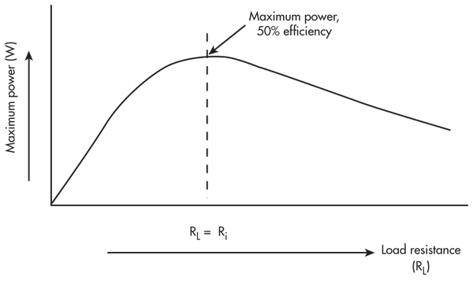
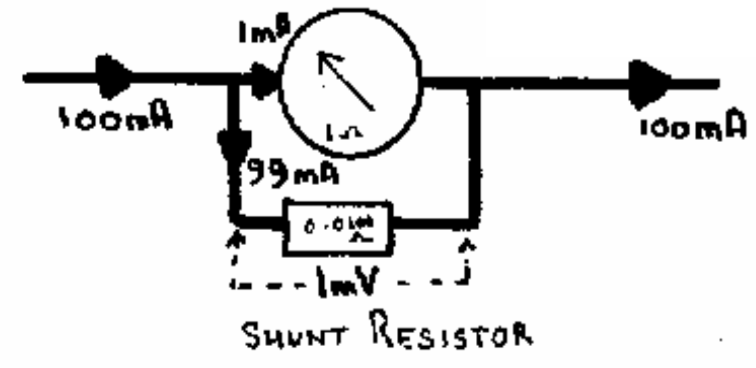
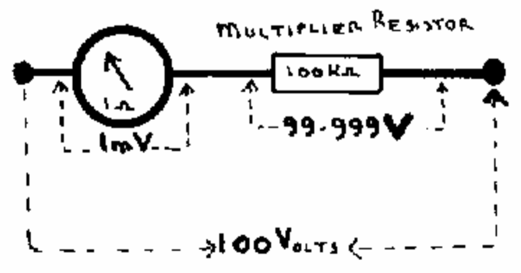

# 3. Electromagnetism

## Definitions

- **Mutual Inductance** is the principle of transformers where a **changing current** in primary circuit can **induce a voltage** into a secondary circuit
- **Lens's Law** states that when the current through an inductor changes the voltage induced in it is in such a direction as to oppose the original change
- Currents circulating in the core are known as **eddy currents**.
- **Impedance matching** is the practice of designing the input impedance of an electrical load or the output impedance of its corresponding signal source to *maximize the power transfer* or minimize signal reflection from the load.

## Units of measurement

- `Henry` is mutual inductance between two coils

## Formula

- `P (in) = P (out)`, where `P (in)` is power in the primary circuit and `P (out)` is the power in the secondary circuit (assuming no losses)
- `Vs / Vp = Ts / Tp` where `Vs` is voltage in secondary circuit, `Vp` is voltage in the primary circuit, `Ts` is turns in the secondary circuit, `Tp` is the turns in the primary circuit
- `Voltage generated ∝ rate of change of the magnetic field` (faster movement will generate a greater voltage)
- `amount of force on a conductor, carrying a current in a magnetic field ∝ to the current flowing`
- `Impedance ratio = (Turns)²`

## Notes

### Electromagnetism

Voltages induced:

- A **voltage is induced** across the coil if a magnet is moved into a coil a voltage will be generated
- The **voltage will be zero** once the magnet is stationary in the coil
- A **reverse voltage** will be generated when the magnet is withdrawn from the coil

Electricity is produced when:

- **magnetic field is moving** across the wires of the coil
- magnet could be fixed and the **coil is moving** across the magnetic field
- **relative movement** is necessary

### Generator

- If a magnet is rotated near or within a coil a voltage will be generated in that coil
- Voltage will not be constant but will vary like a **sine-wave**
- Voltages:
  - maximum when the end of the magnet passes the coil
  - minimum when it is broadside to the coil
- This will produce **Alternating Voltage**, which will produce an **Alternative Current**

### Electromagnetic Induction

Moving a magnet into a coil produces a voltage because the magnetic lines of force pass (or cut) through the turns of wire

### Mutual induction

- The alternating current in the primary coil produces a changing magnetic field
- The voltage induced into the secondary coil is "up-side down" when compared to the primary current

### Self inductance

- Opposition to the change in current is known as self inductance
-  An alternating current, as it is changing all the time, finds it very difficult to pass through an inductor
- The higher the AC frequency the higher the
opposition

### Inductors

- The value of an inductance depends mainly on the number of turns in the coil and the core
- inductance increase by
  - more turns of wire
  - inserting an iron or **ferrite core**
- inductance reduced by
  - lesser turns
  - removing the ferrous core
  - **brass core** will actually reduce the inductance below the air core value

### Eddy Currents

- If the core of an inductor is able to conduct electricity then it will absorb some of the power and the inductor will be a poor lossy one
- Currents will circulate in the core and are known as eddy currents
- Eddy currents can be prevented by making the core, even metallic, highly resistive.
- Example ferrite, dust iron and laminations

### Transformers

- There must be **good magnetic coupling** between the primary and secondary circuits
- At low frequencies this means that the primary and secondary coils must be **wound on the same magnetic core**
- Cores constructed of a stack of **soft iron laminations that are oxidised** to ensure that they are insulated from each other

### Matching

- power dissipated in the resistor is then calculated for several values of the variable load resistor
- Maximum power transfer takes place when the load is matched to the source.
- AC resistance of the **load** should be matched to the AC resistance of the **source**

> Image credit: [http://electronicdesign.com/](http://electronicdesign.com/communications/back-basics-impedance-matching-part-1)

### Moving coil meters

- amount of force on a conductor, carrying a current in a magnetic field, is proportional to the current flowing - assuming that the magnetic field remains constant
- A core is provided to ensure a uniform magnetic field for the coil to rotate in
- Delicate springs are fitted to the top and bottom of the coil to:
  - conduct the current in and out of the coil
  - to provide the opposing force to balance the motor action

| Ammeter  | Voltmeter |
| - | - |
| low resistance  | high resistance  |
| avoid reducing the current in the circuit under test  | take minimum current from the circuit under test  |
| measure as **high current** as possible  | measure as **high voltage** as possible |
| by adding a shunt resistor in **parallel** with the meter | by adding a multiplier resistor in **series** with the meter
|  |  |

> Image credit of ammeter and voltmeter: [SARTS](http://www.sarts.org.sg/rae/Less3.pdf)
