# license application

> The following are the steps for online application to apply for the station license with equipment information for Singapore (IDA).

1. login to [TLS](https://eservice.ida.gov.sg/tls) (Telecoms Licensing System)
- Create a new client

  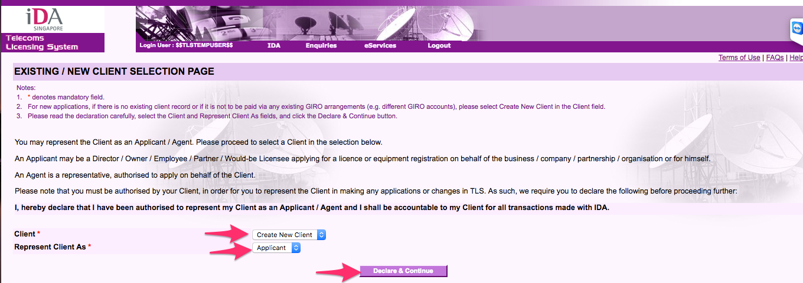
- Add client info

  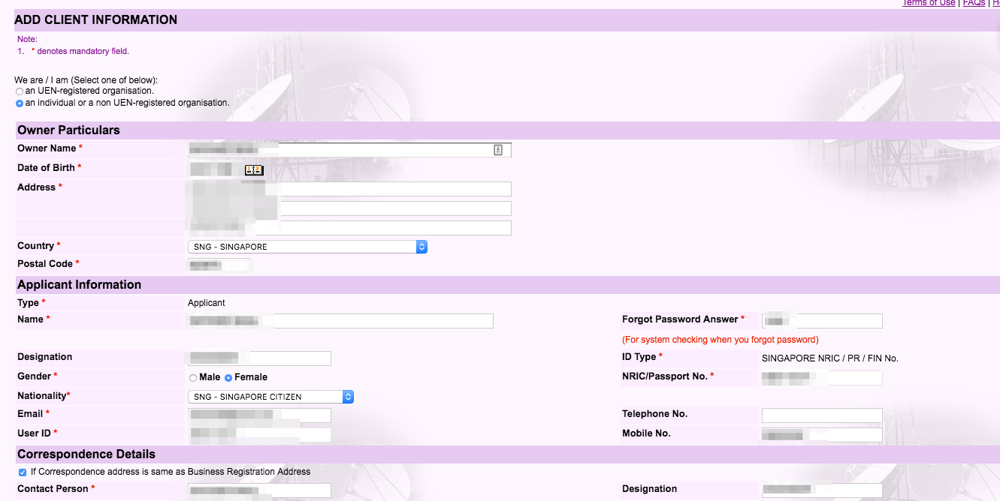
- Save client

  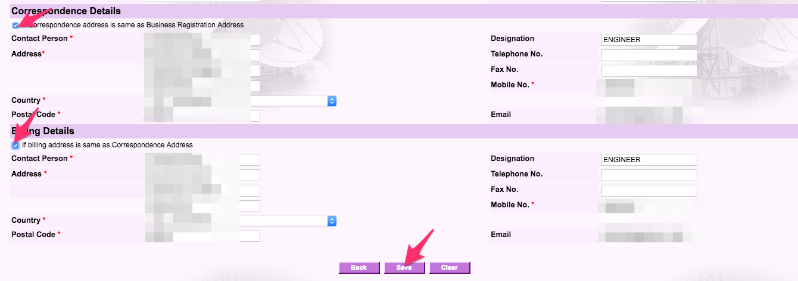
- Client info added successfully

  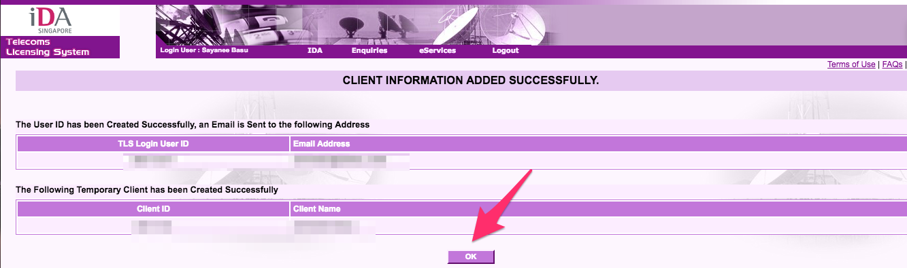
- Choose existing client

  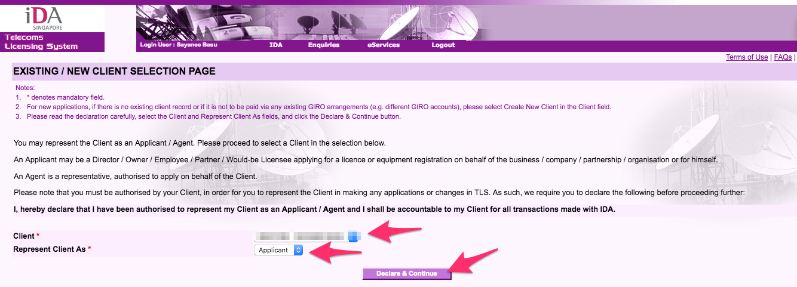
- Select online application

  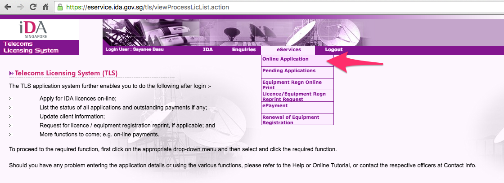
- Choose Amateur Station (General Class) License

  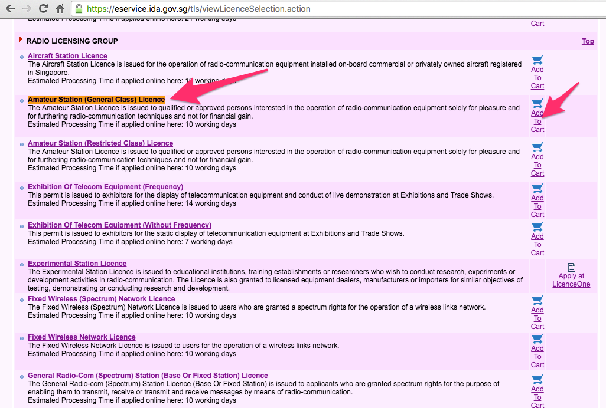
- Proceed with application

  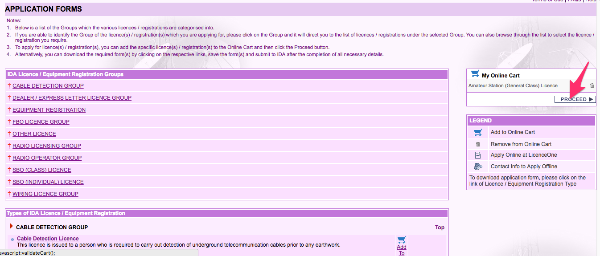
- License / equipment registration

  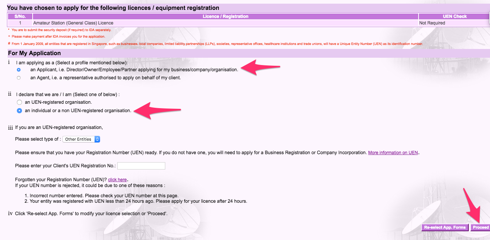
- Amateur Station application - station info

  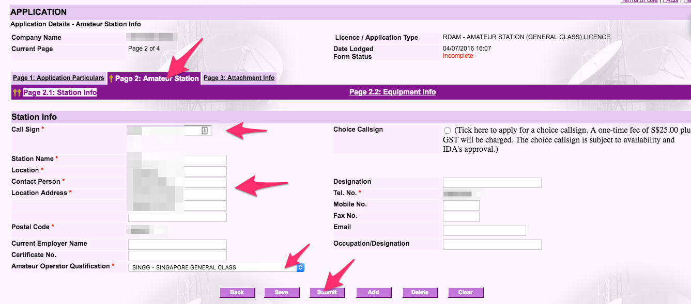
- Amateur Station application - equipment info

  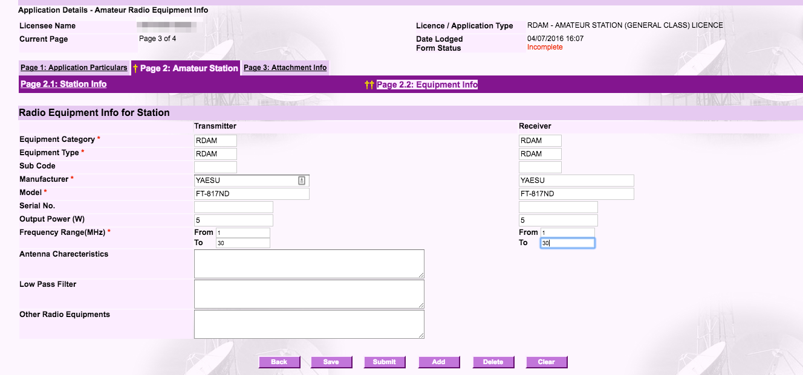
- PDF Attachment

  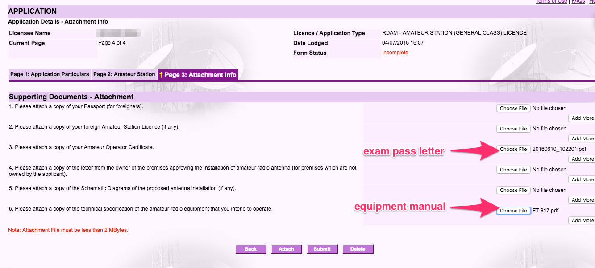
- Submit

  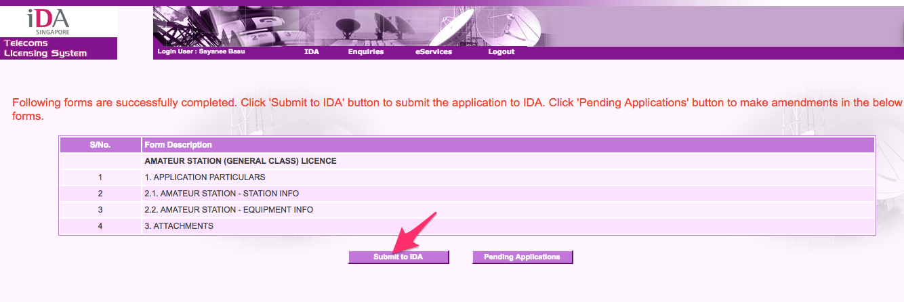
- Confirm

  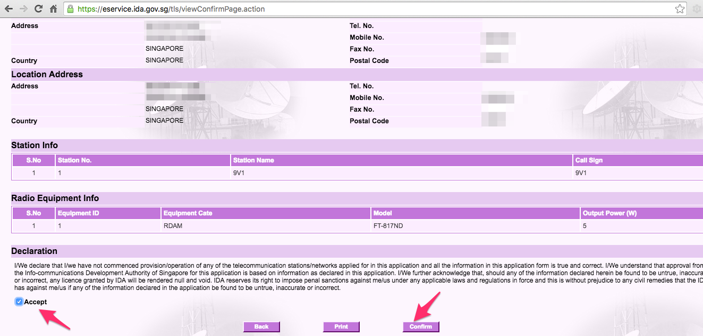

  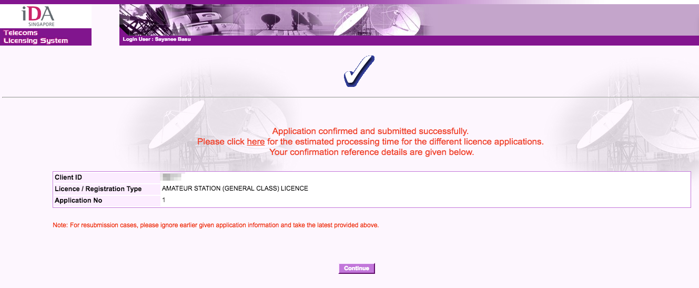
- Check application status

  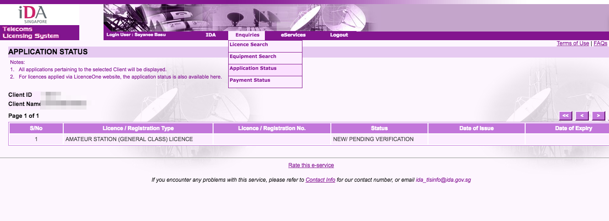
